# Chapter 6 학습 관련 기술들
## 6.1 매개변수 갱신
##### 손실함수를 최소화하는 과정인 "최적화" 
##### 실제로는 매개변수의 공간이 넓고 복잡하기 때문에 순식간에 최소값을 찾는 일은 불가능함
##### SGD : 확률적 경사 하강법은 매개변수의 기울기를 이용해서 최소값을 찾는 방법
이보다 더 효율적인 방법도 존재
## 6.1.1 모험가 이야기
손실함수의 최솟값을 찾는 문제를 '깊은 산골짜기를 탐험하는 모험가'에 비유함
## 6.1.2 확률적 경사 하강법(SGD)

\begin{equation*} W := W - \eta \frac{\partial L}{\partial W} \end{equation*}\begin{equation*} W : 갱신할 매개변수 \end{equation*}\begin{equation*} \frac{\partial L}{\partial W} : 손실 함수의 기울기 \end{equation*}\begin{equation*} \eta : 학습률, 미리 정해서 사용 \end{equation*}


```python
import sys, os #시스템, 운영체제와 상호작용하는 파이썬 함수as
sys.path.append(os.pardir) #부모 경로 지정
os.chdir('C:\\Users\\leejiwon\\Desktop\\프로그래밍\\deep\\deep-learning-from-scratch-master\\deep-learning-from-scratch-master')
import numpy as np #넘파이 불러오기
from dataset.mnist import load_mnist #mnist 데이터셋에서 load_mnist 불러오기
from common.layers import *
from common.gradient import numerical_gradient
from common.functions import *
from collections import OrderedDict
from typing import TypeVar, Generic

(x_train, t_train), (x_test, t_test) = \
    load_mnist(flatten = True, normalize = False)
```


```python
class TwoLayerNet:

    def __init__(self, input_size, hidden_size, output_size, weight_init_std=0.01):
        # 가중치 초기화
        self.params = {}
        self.params['W1'] = weight_init_std * np.random.randn(input_size, hidden_size) #첫 번째 매개변수이므로 입력층, 은닉층 1에 대한 뉴런 수 적용
        self.params['b1'] = np.zeros(hidden_size)
        self.params['W2'] = weight_init_std * np.random.randn(hidden_size, output_size) #두 번째 매개변수이므로 은닉층, 출력층에 대한 뉴런 수 적용
        self.params['b2'] = np.zeros(output_size)

    def predict(self, x):
        W1, W2 = self.params['W1'], self.params['W2']
        b1, b2 = self.params['b1'], self.params['b2']
    
        a1 = np.dot(x, W1) + b1 #예측함수
        z1 = sigmoid(a1) #시그모이드에 적용 (활성화함수)
        a2 = np.dot(z1, W2) + b2 #2번째 예측함수
        y = softmax(a2) #소프트맥스에 적용 (확률값)
        
        return y
        
    # x : 입력 데이터, t : 정답 레이블
    def loss(self, x, t): 
        y = self.predict(x) #손실함수
        
        return cross_entropy_error(y, t) #교차 엔트로피 오차 
    def accuracy(self, x, t): #정확도 
        y = self.predict(x)
        y = np.argmax(y, axis=1)                             
        t = np.argmax(t, axis=1)
        
        accuracy = np.sum(y == t) / float(x.shape[0])
        return accuracy
        
    # x : 입력 데이터, t : 정답 레이블
    def numerical_gradient(self, x, t):
        loss_W = lambda W: self.loss(x, t)
        
        grads = {}
        grads['W1'] = numerical_gradient(loss_W, self.params['W1'])
        grads['b1'] = numerical_gradient(loss_W, self.params['b1'])
        grads['W2'] = numerical_gradient(loss_W, self.params['W2'])
        grads['b2'] = numerical_gradient(loss_W, self.params['b2'])
        
        return grads
    
    def gradient(self, x, t):
        W1, W2 = self.params['W1'], self.params['W2']
        b1, b2 = self.params['b1'], self.params['b2']
        grads = {}
        
        batch_num = x.shape[0]
        
        # forward
        a1 = np.dot(x, W1) + b1
        z1 = sigmoid(a1)
        a2 = np.dot(z1, W2) + b2
        y = softmax(a2)
        
        # backward
        dy = (y - t) / batch_num
        grads['W2'] = np.dot(z1.T, dy)
        grads['b2'] = np.sum(dy, axis=0)
        
        da1 = np.dot(dy, W2.T)
        dz1 = sigmoid_grad(a1) * da1
        grads['W1'] = np.dot(x.T, dz1)
        grads['b1'] = np.sum(dz1, axis=0)

        return grads
```


```python
class SGD: #확률적경사하강법 클래스 정의
    def __init__(self, lr=0.01): #인스턴스변수
        self.lr = lr
    
    def update(self, params, grads): #SGD 동안 반복할 구문
        for key in params.keys(): #params는 딕셔너리 변수
            params[key] -= self.lr * grads[key] #기울기에 따른 갱신
```

network = TwoLayerNet(...)
optimizer = SGD() #최적화 매커니즘으로 SGD 사용 #은닉층과 입력층에 대한 정의 필요

for i in range(10000):
    ...
    x_batch, t_batch = get_mini_batch(...) #미니배치
    grads = network.gradient(x_batch, t_batch) #기울기
    params = network.params 
    optimizer.update(params, grads)

### * SGD 대신 이용할 수 있는 다양한 프레임워크들
#### https://github.com/Lasagne/Lasagne/blob/master/lasagne/updates.py

## 6.1.3 SGD의 단점

\begin{equation*} f(x,y) = \frac{1}{20} x^2 + y^2 \end{equation*}


```python
# 그림 6-1의 함수 시각화
%matplotlib inline
import numpy as np
import matplotlib.pylab as plt
from mpl_toolkits.mplot3d import Axes3D
X = np.arange(-10, 10, 0.5)
Y = np.arange(-10, 10, 0.5)
XX, YY = np.meshgrid(X, Y)
ZZ = (1 / 20) * XX**2 + YY**2

fig = plt.figure()
ax = Axes3D(fig)
ax.plot_surface(XX, YY, ZZ, rstride=1, cstride=1, cmap='hot');
```


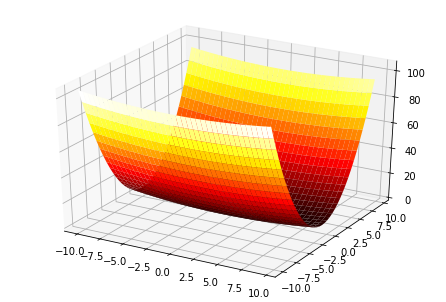


```python
# 그림 6-1 f(x, y) = (1/20) * x**2 + y**2 등고선
plt.contour(XX, YY, ZZ, 100, colors='k')
plt.ylim(-10, 10)
plt.xlim(-10, 10)
```


    (-10, 10)


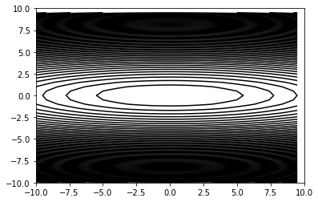


##### 특징 : y축 방향은 가파른데, x축 방향은 완만함
##### 기울기에 따라 최저점이 대부분 (0,0)을 가리키지 않음


```python
def _numerical_gradient_no_batch(f, x):
    h = 1e-4 # 0.0001
    grad = np.zeros_like(x) # x와 형상이 같은 배열을 생성
    
    for idx in range(x.size):
        tmp_val = x[idx]
        
        # f(x+h) 계산
        x[idx] = float(tmp_val) + h
        fxh1 = f(x)
        
        # f(x-h) 계산
        x[idx] = tmp_val - h 
        fxh2 = f(x) 
        
        grad[idx] = (fxh1 - fxh2) / (2*h)
        x[idx] = tmp_val # 값 복원
        
    return grad
```


```python
# 그림 6-2의 기울기 정보
from mpl_toolkits.mplot3d import Axes3D

def numerical_gradient(f, X):
    if X.ndim == 1:
        return _numerical_gradient_no_batch(f, X)
    else:
        grad = np.zeros_like(X)
        
        for idx, x in enumerate(X):
            grad[idx] = _numerical_gradient_no_batch(f, x)
        
        return grad

def function_2(x):
    if x.ndim == 1:
        return np.sum(x**2)
    else:
        return np.sum(x**2, axis=1)
     
x0 = np.arange(-10, 10, 1)
x1 = np.arange(-10, 10, 1)
X, Y = np.meshgrid(x0, x1)
    
X = X.flatten()
Y = Y.flatten()

grad = numerical_gradient(function_2, np.array([(1/(20**0.5))*X, Y]) )
    
plt.figure()
plt.quiver(X, Y, -grad[0], -grad[1],  angles="xy",color="#666666")#,headwidth=10,scale=40,color="#444444")
plt.xlim([-10, 10])
plt.ylim([-5, 5])
plt.xlabel('x0')
plt.ylabel('x1')
plt.grid()
plt.legend()
plt.draw()
plt.show()
```

    No handles with labels found to put in legend.
    


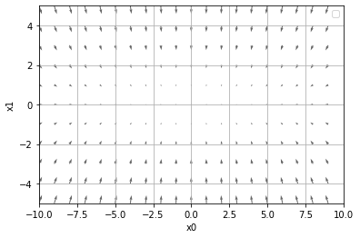


##### 특징 : 대부분 최저점인 (0,0)을 가리키고 있지 않음
##### 이대로 SGD를 적용하게 되면 '비등방성 함수'의 성질에 따라 비효율적인 경로 [그림 6-3]을 그리며 최저점을 탐색하게 됨

## 6.1.4 모멘텀

\begin{equation*} v := \alpha v - \eta 
    \frac{\partial{L}}{\partial{W}} 
    \end{equation*}

\begin{equation*} W := W + v \end{equation*}\begin{equation*} W : 갱신할 매개변수 \end{equation*}\begin{equation*} \frac{\partial L}{\partial W} : 손실 함수의 기울기 \end{equation*}\begin{equation*} \eta : 학습률, 미리 정해서 사용 \end{equation*}

##### 모멘텀 : 물리에서 말하는 '운동량' 
> 공이 바닥을 구르듯 기울기 방향으로 가중되는 움직임
##### av항은 물리에서 '지면 마찰', '공기 저항'과 같은 역할
> 기울기 영향을 받지 않을 때 서서히 변화하는 역할


```python
class Momentum:
    def __init__(self, lr = 0.01, momentum = 0.9):
        self.lr = lr
        self.momentum = momentum
        self.v = None #초기화 값은 아무것도 지정하지 않음
        
    def update(self, params, grads):
        if self.v is None:
            self.v = {}
            for key, val in params.items():
                self.v[key] = np.zeros_like(val) #update에서 매개변수와 같은 구조의 데이터를 딕셔너리 변수로 저장함
                
        for key in params.keys(): #위의 식 구현
            self.v[key] = self.momentum*self.v[key] - self.lr * grads[key]
            params[key] += self.v[key]
```

##### 최적 갱신 경로에서 모멘텀이 SGD 방법보다 지그재그 정도가 덜함
##### x축 방향으로 빠르게 다다가기 때문

## 6.1.5 AdaGrad

##### 신경망학습에서는 학습률을 잘 설정해야 함 
> 너무 작으면 거의 갱신되지 않고 너무 크면 발산하기 때문
##### 적정한 학습률을 정하기 위해 '학습률 감소' 기법 사용
#### AdaGrad : 각각의 매개변수에 따른 맞춤값 지정

\begin{equation*} h := h + \frac{\partial{L}}{\partial{W}} \odot \frac{\partial{L}}{\partial{W}} \end{equation*}

\begin{equation*} W := W - \eta \frac{1}{\sqrt{h}} \frac{\partial{L}}{\partial{W}} \end{equation*}\begin{equation*} W : 갱신할 매개변수 \end{equation*}\begin{equation*} \frac{\partial L}{\partial W} : 손실 함수의 기울기 \end{equation*}\begin{equation*} \eta : 학습률, 미리 정해서 사용 \end{equation*}

##### h는 기존 기울기의 제곱수, 이를 학습률에 반영하여 너무 크게 갱신되었던 값에 대해서는 학습률을 낮춤
#### AdaGrad는 너무 매몰차기 때문에 이를 개선한 RMSProp 방법을 사용하기도 함 
> 이전의 갱신 값은 서서히 잊음 : 지수이동평균 (EMA)


```python
class AdaGrad:
    def __init__(self, lr = 0.01):
        self.lr = lr
        self.h = None
    
    def update(self, params, grads):
        if self.h is None:
            self.h = {}
            for key, val in params.items():
                self.h[key] = np.zeros_like(val)
                
        for key in params.key():
            self.h[key] += grads[key] * grads[key]
            params[key] -= self.lr * grads[key] / (np.sqrt(self.h[key]) + 1e-7)
```

##### 두 번째 식의 h 값에 작은 수를 더해줌으로써 0으로 나눠지는 일을 막음
#### AdaGrad로 최적 경로를 구하게 되면 SGD, 모멘텀 기법에 비해 더 효율적으로 최적값에 도달하는 것을 알 수 있음
> 크게 갱신되는 값(y)에 대해 갱신 강도를 빠르게 작아지도록 만들기 때문

## 6.1.6 Adam

##### 모멘텀과 AdaGrad 갱신방법의 융합버전
> 매개변수 공간을 효율적으로 탐색하며 하이퍼파라미터의 편향을 보정하는 기능
##### 갱신 경로를 보면 모멘텀과 같이 그릇 바닥을 구르듯 갱신되며 모멘텀보다 더 완만한 경사로 갱신됨
##### 하이퍼파라미터를 3개 설정함 (학습률, 1차 모멘텀용 계수, 2차 모멘텀용 계수) _자세히 다루지 않음


```python
class Adam:

    """Adam (http://arxiv.org/abs/1412.6980v8)"""

    def __init__(self, lr=0.001, beta1=0.9, beta2=0.999):
        self.lr = lr
        self.beta1 = beta1
        self.beta2 = beta2
        self.iter = 0
        self.m = None
        self.v = None
        
    def update(self, params, grads):
        if self.m is None:
            self.m, self.v = {}, {}
            for key, val in params.items():
                self.m[key] = np.zeros_like(val)
                self.v[key] = np.zeros_like(val)
        
        self.iter += 1 #Adam 수식에 대한 자세한 부분은 책에서 다루지 않음
        lr_t  = self.lr * np.sqrt(1.0 - self.beta2**self.iter) / (1.0 - self.beta1**self.iter)         
        
        for key in params.keys():
            #self.m[key] = self.beta1*self.m[key] + (1-self.beta1)*grads[key]
            #self.v[key] = self.beta2*self.v[key] + (1-self.beta2)*(grads[key]**2)
            self.m[key] += (1 - self.beta1) * (grads[key] - self.m[key])
            self.v[key] += (1 - self.beta2) * (grads[key]**2 - self.v[key])
            
            params[key] -= lr_t * self.m[key] / (np.sqrt(self.v[key]) + 1e-7)
            
            #unbias_m += (1 - self.beta1) * (grads[key] - self.m[key]) # correct bias #편향을 조정해주는 기능
            #unbisa_b += (1 - self.beta2) * (grads[key]*grads[key] - self.v[key]) # correct bias
            #params[key] += self.lr * unbias_m / (np.sqrt(unbisa_b) + 1e-7)
```

## 6.1.7 어느 갱신 방법을 이용할 것인가?

##### SGD, 모멘텀, AdaGrad, Adam 네 기법에 대한 최적 경로 비교
> 풀어야 할 문제, 하이퍼파라미터 설정에 따라 최적의 방법이 달라짐 (각자의 장단이 있음)
##### 이 책에서는 SGD 와 Adam 방법을 사용


```python
import matplotlib.pyplot as plt
from collections import OrderedDict
from common.optimizer import *

def f(x, y):
    return x**2 / 20.0 + y**2

def df(x, y):
    return x / 10.0, 2.0*y

init_pos = (-7.0, 2.0) #초깃값 설정
params = {} #디렉토리 매개변수
params['x'], params['y'] = init_pos[0], init_pos[1]
grads = {}
grads['x'], grads['y'] = 0, 0


optimizers = OrderedDict() #4가지 최적화 방법 정의
optimizers["SGD"] = SGD(lr=0.95)
optimizers["Momentum"] = Momentum(lr=0.1)
optimizers["AdaGrad"] = AdaGrad(lr=1.5)
optimizers["Adam"] = Adam(lr=0.3)

idx = 1

for key in optimizers:
    optimizer = optimizers[key]
    x_history = []
    y_history = []
    params['x'], params['y'] = init_pos[0], init_pos[1]
    
    for i in range(30):
        x_history.append(params['x'])
        y_history.append(params['y'])
        
        grads['x'], grads['y'] = df(params['x'], params['y'])
        optimizer.update(params, grads)
    

    x = np.arange(-10, 10, 0.01)
    y = np.arange(-5, 5, 0.01)
    
    X, Y = np.meshgrid(x, y) 
    Z = f(X, Y)
    
    # 외곽선 단순화
    mask = Z > 7
    Z[mask] = 0
    
    # 그래프 그리기
    plt.subplot(2, 2, idx)
    idx += 1
    plt.plot(x_history, y_history, 'o-', color="red")
    plt.contour(X, Y, Z)
    plt.ylim(-10, 10)
    plt.xlim(-10, 10)
    plt.plot(0, 0, '+')
    #colorbar()
    #spring()
    plt.title(key)
    plt.xlabel("x")
    plt.ylabel("y")
    
plt.show()
```


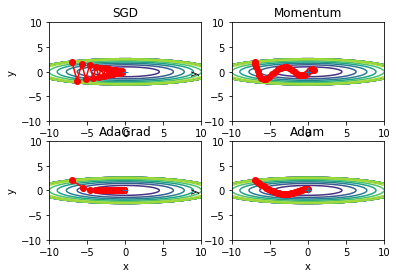


##### 이번 데이터셋에 대해서는 Adam이 가장 효율적으로 갱신되는 것을 알 수 있음

## 6.1.8 MNIST 데이터셋으로 본 갱신 방법 비교


```python
# 손글씨 숫자 인식 데이터에 대한 네 기법의 학습 진도 비교
# 각 층이 100개의 뉴런으로 구성된 5층 신경망에서 ReLU 함수를 활성화함수로 사용

import matplotlib.pyplot as plt
from dataset.mnist import load_mnist
from common.util import smooth_curve
from common.multi_layer_net import MultiLayerNet
#from common.optimizer import *

# 0. MNIST 데이터 읽기==========
(x_train, t_train), (x_test, t_test) = load_mnist(normalize=True)

train_size = x_train.shape[0]
batch_size = 128
max_iterations = 2000

# 1. 실험용 설정==========
optimizers = {}
optimizers['SGD'] = SGD()
optimizers['Momentum'] = Momentum()
optimizers['AdaGrad'] = AdaGrad()
optimizers['Adam'] = Adam()
#optimizers['RMSprop'] = RMSprop()

networks = {}
train_loss = {}
for key in optimizers.keys():
    networks[key] = MultiLayerNet(
        input_size=784, hidden_size_list=[100, 100, 100, 100],
        output_size=10)
    train_loss[key] = []    

# 2. 훈련 시작==========
for i in range(max_iterations):
    batch_mask = np.random.choice(train_size, batch_size)
    x_batch = x_train[batch_mask]
    t_batch = t_train[batch_mask]
    
    for key in optimizers.keys():
        grads = networks[key].gradient(x_batch, t_batch)
        optimizers[key].update(networks[key].params, grads)
    
        loss = networks[key].loss(x_batch, t_batch)
        train_loss[key].append(loss)
    
    #출력 설정
    if i % 100 == 0:
        print( "===========" + "iteration:" + str(i) + "===========")
        for key in optimizers.keys():
            loss = networks[key].loss(x_batch, t_batch)
            print(key + ":" + str(loss))

# 3. 그래프 그리기==========
markers = {"SGD": "o", "Momentum": "x", "AdaGrad": "s", "Adam": "D"}
x = np.arange(max_iterations)
for key in optimizers.keys():
    plt.plot(x, smooth_curve(train_loss[key]), marker=markers[key], markevery=100, label=key)
plt.xlabel("iterations")
plt.ylabel("loss")
plt.ylim(0, 1)
plt.legend()
plt.show()
```

    ===========iteration:0===========
    SGD:2.3370762886452496
    Momentum:2.37016112413242
    AdaGrad:2.223030096428727
    Adam:2.2442446340289073
    ===========iteration:100===========
    SGD:1.3508479827258904
    Momentum:0.3259622159453577
    AdaGrad:0.2068820225022826
    Adam:0.305903509486337
    ===========iteration:200===========
    SGD:0.7594422738457303
    Momentum:0.30114494014228993
    AdaGrad:0.10995291361635512
    Adam:0.2107894000808575
    ===========iteration:300===========
    SGD:0.5946968035100979
    Momentum:0.3021706734077731
    AdaGrad:0.11649993139856248
    Adam:0.13724763420074187
    ===========iteration:400===========
    SGD:0.3311012057216032
    Momentum:0.12679339056236627
    AdaGrad:0.04054905090929833
    Adam:0.06418123245375802
    ===========iteration:500===========
    SGD:0.3892259669048342
    Momentum:0.21163982277544996
    AdaGrad:0.10432147877956055
    Adam:0.1547346551172964
    ===========iteration:600===========
    SGD:0.272441126302081
    Momentum:0.09525837870717205
    AdaGrad:0.046944061966761624
    Adam:0.0462929867079019
    ===========iteration:700===========
    SGD:0.26031575207076296
    Momentum:0.0809414848371287
    AdaGrad:0.041670350887161964
    Adam:0.04944911088698577
    ===========iteration:800===========
    SGD:0.2891999999536304
    Momentum:0.07969355799046793
    AdaGrad:0.0256742676590511
    Adam:0.06167540201968673
    ===========iteration:900===========
    SGD:0.26325451043381654
    Momentum:0.06242354908450795
    AdaGrad:0.023924961008239945
    Adam:0.0285452465383274
    ===========iteration:1000===========
    SGD:0.1938544287061576
    Momentum:0.05047387736894062
    AdaGrad:0.02432850864899102
    Adam:0.025630650366871864
    ===========iteration:1100===========
    SGD:0.15174457742220632
    Momentum:0.04927829500541331
    AdaGrad:0.02210071248071917
    Adam:0.028094072108749063
    ===========iteration:1200===========
    SGD:0.37640944393153525
    Momentum:0.19163331597140337
    AdaGrad:0.08234339035119784
    Adam:0.12479779229946808
    ===========iteration:1300===========
    SGD:0.15590317515663493
    Momentum:0.12636227607490536
    AdaGrad:0.038016734711857667
    Adam:0.05446558132285231
    ===========iteration:1400===========
    SGD:0.2472757635121162
    Momentum:0.0444029782641211
    AdaGrad:0.015609563855190006
    Adam:0.024023007879466082
    ===========iteration:1500===========
    SGD:0.2396772140135622
    Momentum:0.09847237175346331
    AdaGrad:0.04648320353684529
    Adam:0.04524656865682425
    ===========iteration:1600===========
    SGD:0.21993614596025152
    Momentum:0.13688989776316668
    AdaGrad:0.04203848982992611
    Adam:0.10248847184933954
    ===========iteration:1700===========
    SGD:0.14816749712623178
    Momentum:0.04676230062528576
    AdaGrad:0.014530126522043918
    Adam:0.03204008385819952
    ===========iteration:1800===========
    SGD:0.2185066333492297
    Momentum:0.08343754646786404
    AdaGrad:0.05362778973311762
    Adam:0.07638294192502178
    ===========iteration:1900===========
    SGD:0.27943111372197305
    Momentum:0.12688813706839364
    AdaGrad:0.12182580483685872
    Adam:0.13872807311331897
    


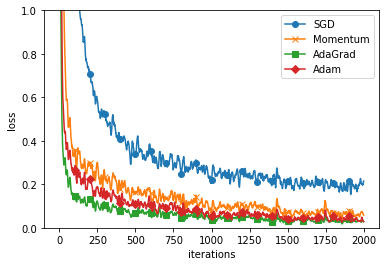


##### 하이퍼파라미터 설정과 신경망 구조에 따라 달라질 수 있지만, 일반적으로 SGD가 나머지 세 방법에 비해 속도, 정확도 면에서 효율성이 떨어짐

# 6.2 가중치의 초깃값

##### 가중치 초깃값 설정에 따라 학습의 성패가 갈림
> 권장 초깃값 설정

## 6.2.1 초깃값을 0으로 하면?

##### 가중치 감소 : 오버피팅을 억제해 범용 성능을 높이는 테크닉 
> 가중치 매개변수의 값이 작아지도록 학습 
##### 작은 가중치를 위해 애초에 가중치를 작게 설정함 (0.01 * np.random.randn(10,100))
> 하지만 0으로 설정하면 오차역전파법에 의해 모든 가중치가 똑같이 갱신되는 문제 발생 
##### 가중치 대칭 문제를 해결하기 위해 random하게 설정함

## 6.2.2 은닉층의 활성화값 분포

##### 활성화함수: 시그모이드, 신경망: 5층 
> 가중치 초기값에 따른 활성화값의 변화


```python
import numpy as np
import matplotlib.pyplot as plt

def sigmoid(x):
    return 1 / (1 + np.exp(-x))

def ReLU(x):
    return np.maximum(0, x)

def tanh(x):
    return np.tanh(x)

input_data = np.random.randn(1000, 100) #1000개의 데이터 중 100개 임의 추출
node_num = 100 #각 은닉층의 노드 (뉴련) 개수
hidden_layer_size = 5 #은닉층 5개
activations = {} #활성화 결과 저장

x = input_data

def get_activation(hidden_layer_size, x, w, a_func = sigmoid):
    for i in range(hidden_layer_size):
        if i != 0:
            x = activations[i-1]
            
        a = np.dot(x, w)
        
        #활성화함수 ReLU, tanh로 바꿔서 실험
        z = a_func(a)
        # z = ReLU(a), z = tanh(a)

        activations[i] = z 
    return activations

#초깃값을 다양하게 바꿔서 실험
w = np.random.randn(node_num, node_num) * 1 #표준편차가 1인 정규분포 (변경 대상)

z = sigmoid
# z = ReLU
# z = tanh

activations = get_activation(hidden_layer_size, x, w, z)
```


```python
# 히스토그램 그리기
def get_histogram(activations):
    
    for i, a in activations.items():
        plt.subplot(1, len(activations) , i + 1)
        plt.title(str(i + 1) + "-layer")
        if i != 0: plt.yticks([], [])
            #plt.xlim(0.1, 1)
            #plt.ylim(0, 7000)
        plt.hist(a.flatten(), 30, range = (0,1))
    plt.show()
    
get_histogram(activations)
```


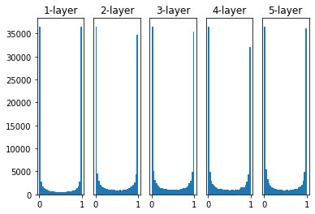


##### 각 층의 활성화값 분포 
> 0과 1에 치중되어 분포함: 해당 값들에서 기울기 값이 0으로 수렴함
##### 가중치 매개변수를 0으로 지정했을 때의 문제와 동일
> 기울기 소실 (gradient vanishing)


```python
# 가중치 표준편차를 0.01로 바꾸었을 때 
w = np.random.randn(node_num, node_num) * 0.01

z = sigmoid
# z = ReLU
# z = tanh

activations = get_activation(hidden_layer_size, x, w, z)
```


```python
# 히스토그램 그리기
get_histogram(activations)
```


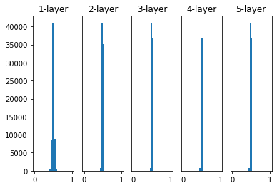


##### 활성화 값들이 0.5에 치우쳐진 모습 
> 기울기 소실 문제는 발생하지 않지만 대부분의 데이터가 한 값에 치중되어 있기 때문에 표현력을 제한하는 문제 발생: 다수의 뉴련이 거의 같은 값을 출력하는 상황
##### 활성화 값은 적당하게 다양한 데이터가 되어야 

* 권장 가중치 초깃값 Xavier 초깃값
> 앞 층의 노드의 개수 (n) 이 커질 수록 가중치는 좁은 분포(1 / np.sqrt(n))를 가짐 


```python
# 가중치 표준편차를 (1 / np.sqrt(n)로 바꾸었을 때
# 앞 층의 노드 수는 100개로 단순화
w = np.random.randn(node_num, node_num) * np.sqrt(1.0 / node_num)

z = sigmoid
# z = ReLU
# z = tanh

activations = get_activation(hidden_layer_size, x, w, z)
```


```python
# 히스토그램 그리기    
get_histogram(activations)
```


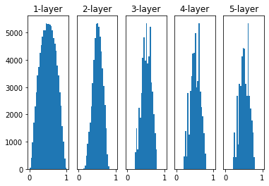


##### 앞선 방식보다 넓게 분포되는 모습 
> 표현력 제한 없이 효율적인 학습 가능
##### tanh함수(쌍곡선 함수)를 사용하면 층을 거듭할 수록 일그러지는 문제 해결, 정규분포화 됨
> sigmoid: 0.05에서 대칭, tanh: 0에서 대칭 > 활성화 함수로 더 적합

## 6.2.3 ReLU를 사용할 때의 가중치 초깃값

##### 선형함수 (sigmoid, tanh)의 경우 Xavier 초깃값 사용, 비선형함수 (ReLU)의 경우 2 / np.sqrt(n) 정규분포인 He 초깃값 사용


```python
# 표준편차가 0.01을 정규분포를 가중치 초깃값으로 사용할 때
w = np.random.randn(node_num, node_num) * 0.01
z = ReLU
activations = get_activation(hidden_layer_size, x, w, z)
get_histogram(activations)

# 아주 작은 활성화 값을 가짐 > 학습이 거의 이루어지지 않음
```


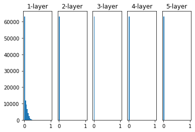


```python
# Xavier 초깃값을 사용할 때
w = np.random.randn(node_num, node_num) * np.sqrt(1.0 / node_num)
activations = get_activation(hidden_layer_size, x, w, z)
get_histogram(activations)

# 층이 거듭될 수록 한 값에 치중되는 모슴 > 기울기 소실 문제
```


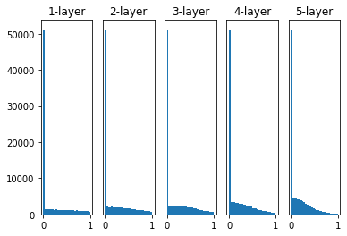


```python
# He 초깃값을 사용할 때
w = np.random.randn(node_num, node_num) * np.sqrt(2.0 / node_num)
activations = get_activation(hidden_layer_size, x, w, z)
get_histogram(activations)

# ReLU함수의 권장 초깃값으로 적정, 기울기 소실, 표현력 제한 문제 없이 고르게 분포함
```


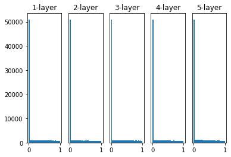


## 6.2.4 MNIST 데이터셋으로 본 가중치 초깃값 비교

##### 실제 데이터셋으로 초깃값에 따른 학습 결과 비교


```python
import sys, os #시스템, 운영체제와 상호작용하는 파이썬 함수as
sys.path.append(os.pardir) #부모 경로 지정
os.chdir('C:\\Users\\leejiwon\\Desktop\\프로그래밍\\deep\\deep-learning-from-scratch-master\\deep-learning-from-scratch-master')

import numpy as np
import matplotlib.pyplot as plt
from dataset.mnist import load_mnist
from common.util import smooth_curve
from common.multi_layer_net import MultiLayerNet
from common.optimizer import SGD

# 0. MNIST 데이터 읽기 ==================
(x_train, t_train), (x_test, t_test) = load_mnist(normalize = True)

train_size = x_train.shape[0]
batch_size = 128
max_iterations = 2000

# 1. 실험용 설정 ==================
weight_init_types = {'std = 0.01': 0.01, 'Xavier': 'sigmoid', 'He' : 'relu'}
optimizer = SGD(lr = 0.01)

networks = {}
train_loss = {}
for key, weight_type in weight_init_types.items():
    networks[key] = MultiLayerNet(input_size = 784, hidden_size_list = [100, 100, 100, 100], 
                                 output_size = 10, weight_init_std = weight_type)
    train_loss[key] = []

# 2. 훈련 시작 ===================
for i in range(max_iterations):
    batch_mask = np.random.choice(train_size, batch_size)
    x_batch = x_train[batch_mask]
    t_batch = t_train[batch_mask]
    
    for key in weight_init_types.keys():
        grads = networks[key].gradient(x_batch, t_batch)
        optimizer.update(networks[key].params, grads)
    
        loss = networks[key].loss(x_batch, t_batch)
        train_loss[key].append(loss)
    
    if i % 100 == 0:
        print("===========" + "iteration:" + str(i) + "===========")
        for key in weight_init_types.keys():
            loss = networks[key].loss(x_batch, t_batch)
            print(key + ":" + str(loss))
            
# 3. 그래프 그리기===============
markers = {'std = 0.01' : 'o', 'Xavier' : 's', 'He' : 'D'}
x = np.arange(max_iterations)
for key in weight_init_types.keys():
    plt.plot(x, smooth_curve(train_loss[key]), marker = markers[key], markevery = 100, label = key)
plt.xlabel("iterations")
plt.ylabel("loss")
plt.ylim(0, 2.5)
plt.legend()
plt.show()
```

    ===========iteration:0===========
    std = 0.01:2.3025363894321096
    Xavier:2.2983684777268847
    He:2.336334179836771
    ===========iteration:100===========
    std = 0.01:2.3019542674202915
    Xavier:2.2693057961234375
    He:1.4240431729908727
    ===========iteration:200===========
    std = 0.01:2.301552711883603
    Xavier:2.1858796664324043
    He:0.6387308835088698
    ===========iteration:300===========
    std = 0.01:2.302015600043685
    Xavier:1.996444891843161
    He:0.4624570471724692
    ===========iteration:400===========
    std = 0.01:2.3023902143424584
    Xavier:1.6583334536306045
    He:0.5483696531666836
    ===========iteration:500===========
    std = 0.01:2.3007740003812156
    Xavier:1.0534878720678265
    He:0.36693251583095365
    ===========iteration:600===========
    std = 0.01:2.3031847094081837
    Xavier:0.6754123843687649
    He:0.286971810059828
    ===========iteration:700===========
    std = 0.01:2.3024244617418534
    Xavier:0.6482446117279457
    He:0.2821220477429144
    ===========iteration:800===========
    std = 0.01:2.3030950752430908
    Xavier:0.533251105521032
    He:0.27812350069126446
    ===========iteration:900===========
    std = 0.01:2.2994665826260547
    Xavier:0.44154963175354545
    He:0.27986824792797926
    ===========iteration:1000===========
    std = 0.01:2.2989752688463208
    Xavier:0.4183070681515376
    He:0.22932856613195976
    ===========iteration:1100===========
    std = 0.01:2.3015753571795448
    Xavier:0.4265620188181194
    He:0.30272633081934985
    ===========iteration:1200===========
    std = 0.01:2.3035838426805224
    Xavier:0.30964859219138596
    He:0.19741819130223348
    ===========iteration:1300===========
    std = 0.01:2.300514874802806
    Xavier:0.29349716295377537
    He:0.1549102716543394
    ===========iteration:1400===========
    std = 0.01:2.298258861895502
    Xavier:0.513741024922889
    He:0.35060472468711346
    ===========iteration:1500===========
    std = 0.01:2.2972336531570514
    Xavier:0.21566384022719845
    He:0.1509858188815841
    ===========iteration:1600===========
    std = 0.01:2.2963679250947884
    Xavier:0.2230668312507561
    He:0.14345016751963557
    ===========iteration:1700===========
    std = 0.01:2.299644025754134
    Xavier:0.31201325328135865
    He:0.2281046139026686
    ===========iteration:1800===========
    std = 0.01:2.302914628299612
    Xavier:0.37047029626854255
    He:0.245845881877702
    ===========iteration:1900===========
    std = 0.01:2.3025398311775107
    Xavier:0.37590881610360666
    He:0.27555228924133995
    


##### 뉴런 개수 100개, 5층 신경망, ReLU를 활성화 함수로 사용한 학습
> 표준 편차 0.01 : 학습 거의 진행되지 않음, Xavier보다 He 초깃값이 학습진도가 더 빠름

# 6.3 배치 정규화

##### 각 층의 활성화값 분포를 적절히 떨어뜨려 효율적인 학습이 가능하도록 '강제'하는 방법

## 6.3.1 배치 정규화 알고리즘

##### 배치 정규화가 주목받는 이유 
> 1) 학습 속도 개선 2) 초깃값 의존도 낮음 3) 오버피팅 억제

##### 배치 정규화를 실행하기 위해 활성함수 층 앞 or 뒤에 '배치 정규화 계층' 삽입
> 미니 배치를 단위로 평균이 0, 분산이 1이 되도록 정규화

\begin{equation*} \mu_{B} := \frac{1}{m} \sum^{m}_{i=1} x_{i} \end{equation*}\begin{equation*} \sigma^{2}_{B} := \frac{1}{m} \sum^{m}_{i=1} (x_{i} - \mu_{B})^{2} \end{equation*}\begin{equation*} x_{i} := \frac{x_{i}-\mu_{B}}{\sqrt{\sigma^{2}_{B}+\epsilon}} \end{equation*}

##### 기호 엡실론은 분모가 0이 되지 않게 하기위한 작은 상수 
> 이런 일련의 과정을 통해 분포가 덜 치우치고 효율적인 학습이 가능하도록 함 

##### 배치 정규화 계층에 확대, 이동 작업을 수행함 
> 아래 식에서 감마가 확대, 베타가 이동을 나타내며 초깃값은 (1, 0) : 원본 그대로에서 시작

\begin{equation*} y_{i} = \gamma \hat{x_{i}} + \beta \end{equation*}

##### 이를 신경망에서 순전파에 적용해보면 계산 그래프에 의해 표현 가능 [그림 6-17]
##### https://kratzert.github.io/2016/02/12/understanding-the-gradient-flow-through-the-batch-normalization-layer.html 에서 계산그래프 알고리즘 확인 가능
> 역전파는 다소 복잡하므로 생략

## 6.3.2 배치 정규화의 효과


```python
import numpy as np
import matplotlib.pyplot as plt
from dataset.mnist import load_mnist
from common.multi_layer_net_extend import MultiLayerNetExtend
from common.optimizer import SGD, Adam

(x_train, t_train), (x_test, t_test) = load_mnist(normalize = True)

# 학습 데이터를 줄임====================
x_train = x_train[:1000]
t_train = t_train[:1000]

max_epochs = 20
train_size = x_train.shape[0]
batch_size = 100
learning_rate = 0.01

def __train(weight_init_std):
    bn_network = MultiLayerNetExtend(input_size = 784, hidden_size_list = [100, 100, 100, 100, 100], 
                                    output_size = 10, weight_init_std = weight_init_std, use_batchnorm = True)
    network = MultiLayerNetExtend(input_size = 784, hidden_size_list = [100, 100, 100, 100, 100],
                                 output_size = 10, weight_init_std = weight_init_std)
    optimizer = SGD(lr = learning_rate)
    
    train_acc_list = []
    bn_train_acc_list = []
    
    iter_per_epoch = max(train_size / batch_size, 1)
    epoch_cnt = 0
    
    for i in range(1000000000):
        batch_mask = np.random.choice(train_size, batch_size)
        x_batch = x_train[batch_mask]
        t_batch = t_train[batch_mask]
        
        for _network in (bn_network, network):
            grads = _network.gradient(x_batch, t_batch)
            optimizer.update(_network.params, grads)
            
        if i % iter_per_epoch == 0:
            train_acc = network.accuracy(x_train, t_train)
            bn_train_acc = bn_network.accuracy(x_train, t_train)
            train_acc_list.append(train_acc)
            bn_train_acc_list.append(bn_train_acc)
            
            print("epoch:" + str(epoch_cnt) + " / " + str(train_acc) + " - " + str(bn_train_acc))
            
            epoch_cnt += 1
            if epoch_cnt >= max_epochs:
                break
            
    return train_acc_list, bn_train_acc_list

# 그래프 그리기===================
weight_scale_list = np.logspace(0, -4, num = 16)
x = np.arange(max_epochs)

for i, w in enumerate(weight_scale_list):
    print( "=============== " + str(i + 1) + "/16" + " ================")
    train_acc_list, bn_train_acc_list = __train(w)
    
    plt.subplot(4, 4, i + 1)
    plt.title("W: " + str(w))
    if i == 15:
        plt.plot(x, bn_train_acc_list, label = 'Batch Normalization', markevery = 2)
        plt.plot(x, train_acc_list, linestyle = "--", label = 'Normal(without BatchNorm)', 
                markevery = 2)
    else:
        plt.plot(x, bn_train_acc_list, markevery =2)
        plt.plot(x, train_acc_list, linestyle = '--', markevery =2)
        
    plt.ylim(0, 1.0)
    if i % 4:
        plt.yticks([])
    else:
        plt.ylabel("accuracy")
    
    if i < 12:
        plt.xticks([])
    else: 
        plt.xlabel("epochs")
    plt.legend(loc = 'lower right')

plt.show()
```

    =============== 1/16 ================
    epoch:0 / 0.1 - 0.094
    

    C:\Users\leejiwon\Desktop\프로그래밍\deep\deep-learning-from-scratch-master\deep-learning-from-scratch-master\common\layers.py:12: RuntimeWarning: invalid value encountered in less_equal
      self.mask = (x <= 0)
    C:\Users\leejiwon\Desktop\프로그래밍\deep\deep-learning-from-scratch-master\deep-learning-from-scratch-master\common\multi_layer_net_extend.py:101: RuntimeWarning: overflow encountered in square
      weight_decay += 0.5 * self.weight_decay_lambda * np.sum(W**2)
    C:\Users\leejiwon\Desktop\프로그래밍\deep\deep-learning-from-scratch-master\deep-learning-from-scratch-master\common\multi_layer_net_extend.py:101: RuntimeWarning: invalid value encountered in double_scalars
      weight_decay += 0.5 * self.weight_decay_lambda * np.sum(W**2)
    

    epoch:1 / 0.097 - 0.1
    epoch:2 / 0.097 - 0.108
    epoch:3 / 0.097 - 0.124
    epoch:4 / 0.097 - 0.144
    epoch:5 / 0.097 - 0.171
    epoch:6 / 0.097 - 0.203
    epoch:7 / 0.097 - 0.224
    epoch:8 / 0.097 - 0.253
    epoch:9 / 0.097 - 0.278
    epoch:10 / 0.097 - 0.308
    epoch:11 / 0.097 - 0.322
    epoch:12 / 0.097 - 0.341
    epoch:13 / 0.097 - 0.364
    epoch:14 / 0.097 - 0.384
    epoch:15 / 0.097 - 0.393
    epoch:16 / 0.097 - 0.413
    epoch:17 / 0.097 - 0.423
    epoch:18 / 0.097 - 0.434
    

    No handles with labels found to put in legend.
    

    epoch:19 / 0.097 - 0.445
    =============== 2/16 ================
    epoch:0 / 0.105 - 0.145
    

    C:\Users\leejiwon\Desktop\프로그래밍\deep\deep-learning-from-scratch-master\deep-learning-from-scratch-master\common\functions.py:34: RuntimeWarning: invalid value encountered in subtract
      x = x - np.max(x, axis=0)
    

    epoch:1 / 0.097 - 0.122
    epoch:2 / 0.097 - 0.129
    epoch:3 / 0.097 - 0.147
    epoch:4 / 0.097 - 0.172
    epoch:5 / 0.097 - 0.186
    epoch:6 / 0.097 - 0.215
    epoch:7 / 0.097 - 0.238
    epoch:8 / 0.097 - 0.264
    epoch:9 / 0.097 - 0.292
    epoch:10 / 0.097 - 0.309
    epoch:11 / 0.097 - 0.346
    epoch:12 / 0.097 - 0.369
    epoch:13 / 0.097 - 0.394
    epoch:14 / 0.097 - 0.397
    epoch:15 / 0.097 - 0.426
    epoch:16 / 0.097 - 0.44
    epoch:17 / 0.097 - 0.46
    

    No handles with labels found to put in legend.
    

    epoch:18 / 0.097 - 0.48
    epoch:19 / 0.097 - 0.494
    =============== 3/16 ================
    epoch:0 / 0.137 - 0.103
    epoch:1 / 0.422 - 0.091
    epoch:2 / 0.536 - 0.132
    epoch:3 / 0.651 - 0.183
    epoch:4 / 0.725 - 0.229
    epoch:5 / 0.768 - 0.291
    epoch:6 / 0.8 - 0.333
    epoch:7 / 0.851 - 0.362
    epoch:8 / 0.884 - 0.411
    epoch:9 / 0.909 - 0.452
    epoch:10 / 0.93 - 0.495
    epoch:11 / 0.925 - 0.522
    epoch:12 / 0.955 - 0.538
    epoch:13 / 0.964 - 0.57
    epoch:14 / 0.97 - 0.594
    epoch:15 / 0.976 - 0.603
    epoch:16 / 0.985 - 0.624
    epoch:17 / 0.989 - 0.644
    epoch:18 / 0.988 - 0.652
    epoch:19 / 0.992 - 0.666
    

    No handles with labels found to put in legend.
    

    =============== 4/16 ================
    epoch:0 / 0.126 - 0.105
    epoch:1 / 0.307 - 0.13
    epoch:2 / 0.456 - 0.195
    epoch:3 / 0.545 - 0.275
    epoch:4 / 0.602 - 0.347
    epoch:5 / 0.631 - 0.416
    epoch:6 / 0.669 - 0.472
    epoch:7 / 0.697 - 0.513
    epoch:8 / 0.718 - 0.543
    epoch:9 / 0.749 - 0.57
    epoch:10 / 0.758 - 0.604
    epoch:11 / 0.777 - 0.633
    epoch:12 / 0.793 - 0.657
    epoch:13 / 0.824 - 0.681
    epoch:14 / 0.818 - 0.708
    epoch:15 / 0.839 - 0.72
    epoch:16 / 0.854 - 0.744
    epoch:17 / 0.854 - 0.748
    epoch:18 / 0.853 - 0.773
    

    No handles with labels found to put in legend.
    

    epoch:19 / 0.865 - 0.779
    =============== 5/16 ================
    epoch:0 / 0.074 - 0.09
    epoch:1 / 0.078 - 0.199
    epoch:2 / 0.08 - 0.305
    epoch:3 / 0.085 - 0.426
    epoch:4 / 0.089 - 0.507
    epoch:5 / 0.1 - 0.574
    epoch:6 / 0.115 - 0.636
    epoch:7 / 0.127 - 0.686
    epoch:8 / 0.136 - 0.724
    epoch:9 / 0.149 - 0.745
    epoch:10 / 0.147 - 0.765
    epoch:11 / 0.152 - 0.783
    epoch:12 / 0.167 - 0.814
    epoch:13 / 0.197 - 0.829
    epoch:14 / 0.22 - 0.838
    epoch:15 / 0.255 - 0.85
    epoch:16 / 0.274 - 0.859
    epoch:17 / 0.29 - 0.873
    epoch:18 / 0.309 - 0.876
    epoch:19 / 0.333 - 0.887
    

    No handles with labels found to put in legend.
    

    =============== 6/16 ================
    epoch:0 / 0.077 - 0.12
    epoch:1 / 0.093 - 0.192
    epoch:2 / 0.117 - 0.396
    epoch:3 / 0.117 - 0.541
    epoch:4 / 0.117 - 0.641
    epoch:5 / 0.117 - 0.713
    epoch:6 / 0.117 - 0.764
    epoch:7 / 0.117 - 0.8
    epoch:8 / 0.117 - 0.833
    epoch:9 / 0.117 - 0.856
    epoch:10 / 0.117 - 0.876
    epoch:11 / 0.117 - 0.882
    epoch:12 / 0.117 - 0.902
    epoch:13 / 0.119 - 0.913
    epoch:14 / 0.117 - 0.921
    epoch:15 / 0.119 - 0.931
    epoch:16 / 0.117 - 0.931
    epoch:17 / 0.117 - 0.944
    epoch:18 / 0.117 - 0.955
    

    No handles with labels found to put in legend.
    

    epoch:19 / 0.117 - 0.961
    =============== 7/16 ================
    epoch:0 / 0.117 - 0.101
    epoch:1 / 0.117 - 0.219
    epoch:2 / 0.117 - 0.535
    epoch:3 / 0.116 - 0.679
    epoch:4 / 0.116 - 0.735
    epoch:5 / 0.116 - 0.777
    epoch:6 / 0.116 - 0.808
    epoch:7 / 0.116 - 0.844
    epoch:8 / 0.116 - 0.875
    epoch:9 / 0.116 - 0.908
    epoch:10 / 0.116 - 0.922
    epoch:11 / 0.116 - 0.938
    epoch:12 / 0.116 - 0.947
    epoch:13 / 0.117 - 0.954
    epoch:14 / 0.117 - 0.962
    epoch:15 / 0.116 - 0.969
    epoch:16 / 0.116 - 0.981
    epoch:17 / 0.116 - 0.985
    epoch:18 / 0.116 - 0.987
    

    No handles with labels found to put in legend.
    

    epoch:19 / 0.116 - 0.99
    =============== 8/16 ================
    epoch:0 / 0.105 - 0.106
    epoch:1 / 0.117 - 0.355
    epoch:2 / 0.117 - 0.711
    epoch:3 / 0.116 - 0.779
    epoch:4 / 0.116 - 0.832
    epoch:5 / 0.116 - 0.869
    epoch:6 / 0.116 - 0.912
    epoch:7 / 0.116 - 0.943
    epoch:8 / 0.117 - 0.959
    epoch:9 / 0.117 - 0.972
    epoch:10 / 0.117 - 0.982
    epoch:11 / 0.117 - 0.991
    epoch:12 / 0.117 - 0.992
    epoch:13 / 0.117 - 0.995
    epoch:14 / 0.117 - 0.996
    epoch:15 / 0.117 - 0.996
    epoch:16 / 0.117 - 0.998
    epoch:17 / 0.117 - 0.999
    epoch:18 / 0.117 - 0.999
    

    No handles with labels found to put in legend.
    

    epoch:19 / 0.117 - 1.0
    =============== 9/16 ================
    epoch:0 / 0.116 - 0.117
    epoch:1 / 0.116 - 0.477
    epoch:2 / 0.116 - 0.665
    epoch:3 / 0.116 - 0.772
    epoch:4 / 0.116 - 0.855
    epoch:5 / 0.116 - 0.928
    epoch:6 / 0.116 - 0.957
    epoch:7 / 0.116 - 0.976
    epoch:8 / 0.116 - 0.984
    epoch:9 / 0.116 - 0.992
    epoch:10 / 0.116 - 0.996
    epoch:11 / 0.117 - 0.998
    epoch:12 / 0.116 - 0.998
    epoch:13 / 0.116 - 0.998
    epoch:14 / 0.116 - 0.998
    epoch:15 / 0.116 - 1.0
    epoch:16 / 0.116 - 1.0
    epoch:17 / 0.116 - 1.0
    epoch:18 / 0.116 - 1.0
    

    No handles with labels found to put in legend.
    

    epoch:19 / 0.116 - 1.0
    =============== 10/16 ================
    epoch:0 / 0.105 - 0.135
    epoch:1 / 0.099 - 0.653
    epoch:2 / 0.099 - 0.738
    epoch:3 / 0.116 - 0.643
    epoch:4 / 0.117 - 0.792
    epoch:5 / 0.117 - 0.842
    epoch:6 / 0.117 - 0.887
    epoch:7 / 0.117 - 0.939
    epoch:8 / 0.117 - 0.962
    epoch:9 / 0.117 - 0.984
    epoch:10 / 0.117 - 0.986
    epoch:11 / 0.117 - 0.996
    epoch:12 / 0.117 - 0.976
    epoch:13 / 0.117 - 0.96
    epoch:14 / 0.117 - 0.993
    epoch:15 / 0.117 - 0.996
    epoch:16 / 0.117 - 0.998
    epoch:17 / 0.117 - 0.999
    epoch:18 / 0.117 - 0.999
    

    No handles with labels found to put in legend.
    

    epoch:19 / 0.117 - 0.999
    =============== 11/16 ================
    epoch:0 / 0.116 - 0.169
    epoch:1 / 0.116 - 0.513
    epoch:2 / 0.116 - 0.508
    epoch:3 / 0.116 - 0.722
    epoch:4 / 0.116 - 0.795
    epoch:5 / 0.116 - 0.887
    epoch:6 / 0.117 - 0.909
    epoch:7 / 0.116 - 0.863
    epoch:8 / 0.117 - 0.877
    epoch:9 / 0.117 - 0.893
    epoch:10 / 0.117 - 0.897
    epoch:11 / 0.117 - 0.985
    epoch:12 / 0.117 - 0.983
    epoch:13 / 0.117 - 0.99
    epoch:14 / 0.117 - 0.993
    epoch:15 / 0.117 - 0.994
    epoch:16 / 0.117 - 0.945
    epoch:17 / 0.117 - 0.987
    epoch:18 / 0.117 - 0.982
    

    No handles with labels found to put in legend.
    

    epoch:19 / 0.117 - 0.994
    =============== 12/16 ================
    epoch:0 / 0.092 - 0.249
    epoch:1 / 0.105 - 0.481
    epoch:2 / 0.117 - 0.57
    epoch:3 / 0.117 - 0.711
    epoch:4 / 0.117 - 0.776
    epoch:5 / 0.117 - 0.76
    epoch:6 / 0.117 - 0.848
    epoch:7 / 0.117 - 0.873
    epoch:8 / 0.117 - 0.869
    epoch:9 / 0.117 - 0.832
    epoch:10 / 0.117 - 0.879
    epoch:11 / 0.117 - 0.89
    epoch:12 / 0.117 - 0.897
    epoch:13 / 0.117 - 0.988
    epoch:14 / 0.117 - 0.989
    epoch:15 / 0.117 - 0.992
    epoch:16 / 0.117 - 0.992
    epoch:17 / 0.117 - 0.993
    epoch:18 / 0.117 - 0.994
    epoch:19 / 0.117 - 0.994
    

    No handles with labels found to put in legend.
    

    =============== 13/16 ================
    epoch:0 / 0.116 - 0.109
    epoch:1 / 0.116 - 0.48
    epoch:2 / 0.116 - 0.582
    epoch:3 / 0.116 - 0.587
    epoch:4 / 0.116 - 0.591
    epoch:5 / 0.116 - 0.617
    epoch:6 / 0.116 - 0.62
    epoch:7 / 0.116 - 0.669
    epoch:8 / 0.117 - 0.687
    epoch:9 / 0.117 - 0.66
    epoch:10 / 0.117 - 0.685
    epoch:11 / 0.117 - 0.68
    epoch:12 / 0.116 - 0.697
    epoch:13 / 0.117 - 0.7
    epoch:14 / 0.116 - 0.695
    epoch:15 / 0.116 - 0.708
    epoch:16 / 0.116 - 0.706
    epoch:17 / 0.116 - 0.712
    

    No handles with labels found to put in legend.
    

    epoch:18 / 0.117 - 0.696
    epoch:19 / 0.116 - 0.683
    =============== 14/16 ================
    epoch:0 / 0.117 - 0.102
    epoch:1 / 0.116 - 0.393
    epoch:2 / 0.117 - 0.357
    epoch:3 / 0.117 - 0.415
    epoch:4 / 0.117 - 0.427
    epoch:5 / 0.117 - 0.41
    epoch:6 / 0.117 - 0.43
    epoch:7 / 0.117 - 0.506
    epoch:8 / 0.117 - 0.521
    epoch:9 / 0.117 - 0.508
    epoch:10 / 0.117 - 0.482
    epoch:11 / 0.117 - 0.515
    epoch:12 / 0.117 - 0.507
    epoch:13 / 0.117 - 0.518
    epoch:14 / 0.117 - 0.515
    epoch:15 / 0.117 - 0.524
    epoch:16 / 0.117 - 0.518
    epoch:17 / 0.117 - 0.516
    epoch:18 / 0.117 - 0.527
    

    No handles with labels found to put in legend.
    

    epoch:19 / 0.117 - 0.528
    =============== 15/16 ================
    epoch:0 / 0.116 - 0.099
    epoch:1 / 0.117 - 0.195
    epoch:2 / 0.117 - 0.305
    epoch:3 / 0.117 - 0.37
    epoch:4 / 0.116 - 0.363
    epoch:5 / 0.116 - 0.345
    epoch:6 / 0.116 - 0.391
    epoch:7 / 0.116 - 0.413
    epoch:8 / 0.116 - 0.422
    epoch:9 / 0.116 - 0.431
    epoch:10 / 0.116 - 0.495
    epoch:11 / 0.116 - 0.483
    epoch:12 / 0.116 - 0.452
    epoch:13 / 0.116 - 0.5
    epoch:14 / 0.116 - 0.498
    epoch:15 / 0.116 - 0.442
    epoch:16 / 0.116 - 0.484
    epoch:17 / 0.116 - 0.507
    

    No handles with labels found to put in legend.
    

    epoch:18 / 0.116 - 0.457
    epoch:19 / 0.116 - 0.511
    =============== 16/16 ================
    epoch:0 / 0.092 - 0.247
    epoch:1 / 0.117 - 0.118
    epoch:2 / 0.117 - 0.293
    epoch:3 / 0.116 - 0.434
    epoch:4 / 0.116 - 0.469
    epoch:5 / 0.116 - 0.476
    epoch:6 / 0.117 - 0.486
    epoch:7 / 0.116 - 0.469
    epoch:8 / 0.117 - 0.495
    epoch:9 / 0.117 - 0.5
    epoch:10 / 0.117 - 0.496
    epoch:11 / 0.117 - 0.508
    epoch:12 / 0.117 - 0.507
    epoch:13 / 0.117 - 0.508
    epoch:14 / 0.117 - 0.51
    epoch:15 / 0.116 - 0.51
    epoch:16 / 0.117 - 0.51
    epoch:17 / 0.117 - 0.509
    epoch:18 / 0.117 - 0.51
    epoch:19 / 0.117 - 0.51
    


##### 거의 모든 경우 배치 정규화를 사용할 때 학습 진도가 빠르며 가중치 의존도가 낮음

# 6.4 바른 학습을 위해 

##### 오버피팅: 훈련데이터에만 지나치에 적응되어 그 외의 데이터에는 적절히 대응하지 못하는, 범용 능력이 떨어지는 문제

## 6.4.1 오버피팅

##### 오버피팅이 발생하는 경우 : 1) 매개변수가 많고 표현력이 높은 경우, 2) 훈련데이터가 적은 경우 
> 오버피팅 문제가 발생하는 상황을 만들기 위해 기존 MNIST 데이터셋에서 학습데이터 수를 300개로 줄이고, 복잡한 7층 네트워크를 사용함 (활성화함수는 ReLU, 층별 뉴런 수는 100개)


```python
from dataset.mnist import load_mnist

(x_train, t_train), (x_test, t_test) = load_mnist(normalize = True) #데이터 불러오기
x_train = x_train[:300]
t_train = t_train[:300] #오버피팅을 위해 학습데이터 수를 줄임
```


```python
import numpy as np
import matplotlib.pyplot as plt
from common.multi_layer_net import MultiLayerNet
from common.optimizer import SGD

#가중치 감쇠 설정 
weight_decay_lambda = 0 #가중치 감쇠 사용하지 않음
#weight_decay_lambda = 0.1 #사용하는 경우

network = MultiLayerNet(input_size = 784, hidden_size_list = [100, 100, 100, 100, 100, 100], 
                       output_size = 10, weight_decay_lambda = weight_decay_lambda)
optimizer = SGD(lr = 0.01) #학습률이 0.01인 SGD로 매개변수 갱신 
max_epochs = 201
train_size = x_train.shape[0]
batch_size = 100

train_loss_list = []
train_acc_list = [] #에폭단위 정확도 저장 #에폭은 모든 훈련 데이터를 한 번씩 본 주기  
test_acc_list = []

iter_per_epoch = max(train_size / batch_size, 1)
epoch_cnt = 0

for i in range(1000000000):
    batch_mask = np.random.choice(train_size, batch_size)
    x_batch = x_train[batch_mask]
    t_batch = t_train[batch_mask] #x, t 배치 획득
    
    grads = network.gradient(x_batch, t_batch) #기울기 산출
    optimizer.update(network.params, grads) #활성화함수 업데이트
    
    if i % iter_per_epoch == 0:
        train_acc = network.accuracy(x_train, t_train)
        test_acc = network.accuracy(x_test, t_test)
        train_acc_list.append(train_acc)
        test_acc_list.append(test_acc) #정확도 계산
        
        print("epoch:" + str(epoch_cnt) + ", train acc:" + str(train_acc) + "test acc" + str(test_acc))
        
        epoch_cnt += 1
        if epoch_cnt >= max_epochs:
            break
```

    epoch:0, train acc:0.07666666666666666test acc0.0978
    epoch:1, train acc:0.08test acc0.0977
    epoch:2, train acc:0.09666666666666666test acc0.1033
    epoch:3, train acc:0.11333333333333333test acc0.1184
    epoch:4, train acc:0.13666666666666666test acc0.1407
    epoch:5, train acc:0.17333333333333334test acc0.1589
    epoch:6, train acc:0.19333333333333333test acc0.1713
    epoch:7, train acc:0.21333333333333335test acc0.1871
    epoch:8, train acc:0.25666666666666665test acc0.2038
    epoch:9, train acc:0.30666666666666664test acc0.2222
    epoch:10, train acc:0.32test acc0.2378
    epoch:11, train acc:0.36test acc0.2515
    epoch:12, train acc:0.39test acc0.2707
    epoch:13, train acc:0.41333333333333333test acc0.2929
    epoch:14, train acc:0.44666666666666666test acc0.3165
    epoch:15, train acc:0.44666666666666666test acc0.3311
    epoch:16, train acc:0.45666666666666667test acc0.3558
    epoch:17, train acc:0.48test acc0.3785
    epoch:18, train acc:0.49666666666666665test acc0.3894
    epoch:19, train acc:0.54test acc0.4196
    epoch:20, train acc:0.56test acc0.4315
    epoch:21, train acc:0.5766666666666667test acc0.454
    epoch:22, train acc:0.62test acc0.4852
    epoch:23, train acc:0.63test acc0.4939
    epoch:24, train acc:0.6666666666666666test acc0.5099
    epoch:25, train acc:0.7test acc0.5406
    epoch:26, train acc:0.7133333333333334test acc0.5532
    epoch:27, train acc:0.7166666666666667test acc0.5606
    epoch:28, train acc:0.73test acc0.5765
    epoch:29, train acc:0.7433333333333333test acc0.5858
    epoch:30, train acc:0.78test acc0.6037
    epoch:31, train acc:0.78test acc0.6085
    epoch:32, train acc:0.81test acc0.6164
    epoch:33, train acc:0.8133333333333334test acc0.6272
    epoch:34, train acc:0.81test acc0.6297
    epoch:35, train acc:0.8333333333333334test acc0.6348
    epoch:36, train acc:0.8466666666666667test acc0.6369
    epoch:37, train acc:0.8533333333333334test acc0.6462
    epoch:38, train acc:0.8366666666666667test acc0.6412
    epoch:39, train acc:0.8666666666666667test acc0.645
    epoch:40, train acc:0.8533333333333334test acc0.6576
    epoch:41, train acc:0.87test acc0.6692
    epoch:42, train acc:0.8666666666666667test acc0.6674
    epoch:43, train acc:0.87test acc0.6705
    epoch:44, train acc:0.87test acc0.6538
    epoch:45, train acc:0.8833333333333333test acc0.6808
    epoch:46, train acc:0.8833333333333333test acc0.682
    epoch:47, train acc:0.9test acc0.6861
    epoch:48, train acc:0.9test acc0.6902
    epoch:49, train acc:0.8966666666666666test acc0.6936
    epoch:50, train acc:0.9066666666666666test acc0.6903
    epoch:51, train acc:0.9066666666666666test acc0.6973
    epoch:52, train acc:0.9066666666666666test acc0.7002
    epoch:53, train acc:0.9166666666666666test acc0.688
    epoch:54, train acc:0.92test acc0.7034
    epoch:55, train acc:0.9166666666666666test acc0.7065
    epoch:56, train acc:0.9266666666666666test acc0.7136
    epoch:57, train acc:0.9test acc0.6966
    epoch:58, train acc:0.91test acc0.6991
    epoch:59, train acc:0.93test acc0.7143
    epoch:60, train acc:0.9233333333333333test acc0.7156
    epoch:61, train acc:0.93test acc0.7126
    epoch:62, train acc:0.9466666666666667test acc0.709
    epoch:63, train acc:0.93test acc0.7198
    epoch:64, train acc:0.94test acc0.715
    epoch:65, train acc:0.9466666666666667test acc0.7199
    epoch:66, train acc:0.95test acc0.7244
    epoch:67, train acc:0.9433333333333334test acc0.7229
    epoch:68, train acc:0.9433333333333334test acc0.7236
    epoch:69, train acc:0.9466666666666667test acc0.7301
    epoch:70, train acc:0.9633333333333334test acc0.7249
    epoch:71, train acc:0.9633333333333334test acc0.7256
    epoch:72, train acc:0.96test acc0.7322
    epoch:73, train acc:0.96test acc0.732
    epoch:74, train acc:0.96test acc0.7327
    epoch:75, train acc:0.9766666666666667test acc0.7288
    epoch:76, train acc:0.9766666666666667test acc0.7308
    epoch:77, train acc:0.97test acc0.7355
    epoch:78, train acc:0.9766666666666667test acc0.7347
    epoch:79, train acc:0.9766666666666667test acc0.7404
    epoch:80, train acc:0.9866666666666667test acc0.7411
    epoch:81, train acc:0.98test acc0.7381
    epoch:82, train acc:0.9866666666666667test acc0.7357
    epoch:83, train acc:0.9833333333333333test acc0.7379
    epoch:84, train acc:0.9833333333333333test acc0.7355
    epoch:85, train acc:0.9833333333333333test acc0.7406
    epoch:86, train acc:0.9833333333333333test acc0.7358
    epoch:87, train acc:0.99test acc0.7449
    epoch:88, train acc:0.9866666666666667test acc0.7442
    epoch:89, train acc:0.9833333333333333test acc0.7413
    epoch:90, train acc:0.99test acc0.7452
    epoch:91, train acc:0.99test acc0.7451
    epoch:92, train acc:0.9866666666666667test acc0.741
    epoch:93, train acc:0.9866666666666667test acc0.7476
    epoch:94, train acc:0.9866666666666667test acc0.7477
    epoch:95, train acc:0.99test acc0.7452
    epoch:96, train acc:0.9933333333333333test acc0.7524
    epoch:97, train acc:0.99test acc0.7473
    epoch:98, train acc:0.9933333333333333test acc0.7439
    epoch:99, train acc:0.9933333333333333test acc0.7523
    epoch:100, train acc:0.9933333333333333test acc0.7501
    epoch:101, train acc:0.9933333333333333test acc0.7573
    epoch:102, train acc:0.9966666666666667test acc0.7583
    epoch:103, train acc:0.9966666666666667test acc0.7543
    epoch:104, train acc:0.9933333333333333test acc0.7535
    epoch:105, train acc:0.9966666666666667test acc0.75
    epoch:106, train acc:0.9966666666666667test acc0.7572
    epoch:107, train acc:0.9966666666666667test acc0.7528
    epoch:108, train acc:0.9966666666666667test acc0.7534
    epoch:109, train acc:0.9966666666666667test acc0.7537
    epoch:110, train acc:0.9966666666666667test acc0.7572
    epoch:111, train acc:0.9966666666666667test acc0.7536
    epoch:112, train acc:0.9966666666666667test acc0.7583
    epoch:113, train acc:0.9966666666666667test acc0.7615
    epoch:114, train acc:0.9966666666666667test acc0.7579
    epoch:115, train acc:0.9966666666666667test acc0.7558
    epoch:116, train acc:0.9966666666666667test acc0.7557
    epoch:117, train acc:1.0test acc0.7589
    epoch:118, train acc:1.0test acc0.7574
    epoch:119, train acc:0.9966666666666667test acc0.7583
    epoch:120, train acc:0.9966666666666667test acc0.7616
    epoch:121, train acc:1.0test acc0.7585
    epoch:122, train acc:1.0test acc0.7543
    epoch:123, train acc:1.0test acc0.7618
    epoch:124, train acc:1.0test acc0.7574
    epoch:125, train acc:1.0test acc0.7605
    epoch:126, train acc:0.9966666666666667test acc0.7569
    epoch:127, train acc:0.9966666666666667test acc0.7587
    epoch:128, train acc:0.9966666666666667test acc0.7628
    epoch:129, train acc:0.9966666666666667test acc0.763
    epoch:130, train acc:0.9966666666666667test acc0.7612
    epoch:131, train acc:0.9966666666666667test acc0.7636
    epoch:132, train acc:1.0test acc0.7596
    epoch:133, train acc:0.9966666666666667test acc0.7609
    epoch:134, train acc:1.0test acc0.7627
    epoch:135, train acc:1.0test acc0.7637
    epoch:136, train acc:1.0test acc0.7662
    epoch:137, train acc:0.9966666666666667test acc0.7666
    epoch:138, train acc:0.9966666666666667test acc0.7635
    epoch:139, train acc:0.9966666666666667test acc0.763
    epoch:140, train acc:1.0test acc0.7652
    epoch:141, train acc:0.9966666666666667test acc0.7663
    epoch:142, train acc:1.0test acc0.7646
    epoch:143, train acc:1.0test acc0.7638
    epoch:144, train acc:1.0test acc0.7677
    epoch:145, train acc:1.0test acc0.7653
    epoch:146, train acc:1.0test acc0.7672
    epoch:147, train acc:0.9966666666666667test acc0.7653
    epoch:148, train acc:1.0test acc0.7686
    epoch:149, train acc:1.0test acc0.7664
    epoch:150, train acc:1.0test acc0.7635
    epoch:151, train acc:1.0test acc0.7667
    epoch:152, train acc:1.0test acc0.7657
    epoch:153, train acc:1.0test acc0.7681
    epoch:154, train acc:1.0test acc0.767
    epoch:155, train acc:1.0test acc0.7676
    epoch:156, train acc:1.0test acc0.7689
    epoch:157, train acc:1.0test acc0.7695
    epoch:158, train acc:1.0test acc0.7666
    epoch:159, train acc:1.0test acc0.7693
    epoch:160, train acc:1.0test acc0.7666
    epoch:161, train acc:1.0test acc0.7682
    epoch:162, train acc:1.0test acc0.7665
    epoch:163, train acc:1.0test acc0.7698
    epoch:164, train acc:1.0test acc0.7684
    epoch:165, train acc:1.0test acc0.7706
    epoch:166, train acc:1.0test acc0.7725
    epoch:167, train acc:1.0test acc0.7721
    epoch:168, train acc:1.0test acc0.771
    epoch:169, train acc:1.0test acc0.7717
    epoch:170, train acc:1.0test acc0.7703
    epoch:171, train acc:1.0test acc0.7704
    epoch:172, train acc:1.0test acc0.7727
    epoch:173, train acc:1.0test acc0.7726
    epoch:174, train acc:1.0test acc0.7686
    epoch:175, train acc:1.0test acc0.7711
    epoch:176, train acc:1.0test acc0.7702
    epoch:177, train acc:1.0test acc0.7702
    epoch:178, train acc:1.0test acc0.772
    epoch:179, train acc:1.0test acc0.7695
    epoch:180, train acc:1.0test acc0.7693
    epoch:181, train acc:1.0test acc0.7697
    epoch:182, train acc:1.0test acc0.7695
    epoch:183, train acc:1.0test acc0.7722
    epoch:184, train acc:1.0test acc0.7714
    epoch:185, train acc:1.0test acc0.7705
    epoch:186, train acc:1.0test acc0.7718
    epoch:187, train acc:1.0test acc0.7733
    epoch:188, train acc:1.0test acc0.7728
    epoch:189, train acc:1.0test acc0.7744
    epoch:190, train acc:1.0test acc0.7732
    epoch:191, train acc:1.0test acc0.7721
    epoch:192, train acc:1.0test acc0.7728
    epoch:193, train acc:1.0test acc0.7715
    epoch:194, train acc:1.0test acc0.7728
    epoch:195, train acc:1.0test acc0.7725
    epoch:196, train acc:1.0test acc0.772
    epoch:197, train acc:1.0test acc0.7723
    epoch:198, train acc:1.0test acc0.7715
    epoch:199, train acc:1.0test acc0.7726
    epoch:200, train acc:1.0test acc0.7733
    


```python
# 그래프 그리기
markers = {'train': 'o', 'test': 's'}
x = np.arange(max_epochs)
plt.plot(x, train_acc_list, marker = 'o', label = 'train', markevery = 10) #훈련데이터 표기 지정
plt.plot(x, test_acc_list, marker = 's', label = 'test', markevery = 10) #시험 데이터 표기 지정
plt.xlabel("epochs")
plt.ylabel("accuracy")
plt.ylim(0, 1.0)
plt.legend(loc = "lower right") #주석 표기 위치 설정
plt.show()
```


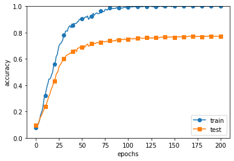


##### 100 epoch 이상부터 훈련데이터는 100%의 정확도를 보이는 반면, 시험데이터에 대해서는 적절한 학습이 이루어지지 못함 
> 훈련데이터를 줄이고 계층을 복잡하게 만들어 오버피팅 문제가 발생함 (범용성을 잃음)

## 6.4.2 가중치 감소

##### 오버피팅 억제 방법 중 하나, 애초에 오버피팅이 큰 가중치에 의해 발생했으므로 이에 패널티를 주고자 하는 아이디어
> 기존 손실함수에 가중치의 제곱노름을 더해줌 (책에서는 L2노름=L2법칙을 사용, L2 노름은 아래 식과 같음)

\begin{equation*} \sqrt{W_{1}^{2}+W_{2}^{2} + ... + W_{n}^{2}} \end{equation*}

##### 제곱 노름을 적용한 가중치 감소는 1/2 λ (W**2) 
> 여기서 람다는 하이퍼파라미터로 패널티 경중을 설정(크게 잡을 수록 큰 패널티 부과), 1/2는 가중치 감소의 미분값에 대한 조정치 


```python
# 람다값을 0.1로 설정한 경우 
#weight_decay_lambda = 0 #가중치 감쇠 사용하지 않음
weight_decay_lambda = 0.1 #사용하는 경우

network = MultiLayerNet(input_size = 784, hidden_size_list = [100, 100, 100, 100, 100, 100], 
                       output_size = 10, weight_decay_lambda = weight_decay_lambda)
optimizer = SGD(lr = 0.01) #학습률이 0.01인 SGD로 매개변수 갱신 
max_epochs = 201
train_size = x_train.shape[0]
batch_size = 100

train_loss_list = []
train_acc_list = [] #에폭단위 정확도 저장 #에폭은 모든 훈련 데이터를 한 번씩 본 주기  
test_acc_list = []

iter_per_epoch = max(train_size / batch_size, 1)
epoch_cnt = 0

for i in range(1000000000):
    batch_mask = np.random.choice(train_size, batch_size)
    x_batch = x_train[batch_mask]
    t_batch = t_train[batch_mask] #x, t 배치 획득
    
    grads = network.gradient(x_batch, t_batch) #기울기 산출
    optimizer.update(network.params, grads) #활성화함수 업데이트
    
    if i % iter_per_epoch == 0:
        train_acc = network.accuracy(x_train, t_train)
        test_acc = network.accuracy(x_test, t_test)
        train_acc_list.append(train_acc)
        test_acc_list.append(test_acc) #정확도 계산
        
        print("epoch:" + str(epoch_cnt) + ", train acc:" + str(train_acc) + "test acc" + str(test_acc))
        
        epoch_cnt += 1
        if epoch_cnt >= max_epochs:
            break

#그래프 그리기
markers = {'train': 'o', 'test': 's'}
x = np.arange(max_epochs)
plt.plot(x, train_acc_list, marker = 'o', label = 'train', markevery = 10) #훈련데이터 표기 지정
plt.plot(x, test_acc_list, marker = 's', label = 'test', markevery = 10) #시험 데이터 표기 지정
plt.xlabel("epochs")
plt.ylabel("accuracy")
plt.ylim(0, 1.0)
plt.legend(loc = "lower right") #주석 표기 위치 설정
plt.show()
```

    epoch:0, train acc:0.1075test acc0.0948
    epoch:1, train acc:0.1575test acc0.1145
    epoch:2, train acc:0.1875test acc0.1459
    epoch:3, train acc:0.2625test acc0.1708
    epoch:4, train acc:0.2675test acc0.19
    epoch:5, train acc:0.2875test acc0.2066
    epoch:6, train acc:0.305test acc0.2257
    epoch:7, train acc:0.34test acc0.2461
    epoch:8, train acc:0.3525test acc0.2627
    epoch:9, train acc:0.365test acc0.2772
    epoch:10, train acc:0.395test acc0.2935
    epoch:11, train acc:0.41test acc0.3067
    epoch:12, train acc:0.425test acc0.3197
    epoch:13, train acc:0.445test acc0.3275
    epoch:14, train acc:0.4475test acc0.3389
    epoch:15, train acc:0.48test acc0.352
    epoch:16, train acc:0.495test acc0.3638
    epoch:17, train acc:0.5125test acc0.3728
    epoch:18, train acc:0.51test acc0.3864
    epoch:19, train acc:0.52test acc0.3937
    epoch:20, train acc:0.5225test acc0.4049
    epoch:21, train acc:0.5425test acc0.4154
    epoch:22, train acc:0.5325test acc0.418
    epoch:23, train acc:0.5625test acc0.4348
    epoch:24, train acc:0.575test acc0.4385
    epoch:25, train acc:0.59test acc0.446
    epoch:26, train acc:0.575test acc0.4405
    epoch:27, train acc:0.6175test acc0.4724
    epoch:28, train acc:0.62test acc0.48
    epoch:29, train acc:0.625test acc0.4856
    epoch:30, train acc:0.625test acc0.4884
    epoch:31, train acc:0.65test acc0.5016
    epoch:32, train acc:0.6625test acc0.5208
    epoch:33, train acc:0.6525test acc0.5236
    epoch:34, train acc:0.675test acc0.5417
    epoch:35, train acc:0.7test acc0.5507
    epoch:36, train acc:0.695test acc0.5579
    epoch:37, train acc:0.7test acc0.567
    epoch:38, train acc:0.7275test acc0.5696
    epoch:39, train acc:0.755test acc0.5805
    epoch:40, train acc:0.7325test acc0.5778
    epoch:41, train acc:0.7525test acc0.5924
    epoch:42, train acc:0.7375test acc0.5828
    epoch:43, train acc:0.7475test acc0.6017
    epoch:44, train acc:0.76test acc0.6082
    epoch:45, train acc:0.795test acc0.6171
    epoch:46, train acc:0.785test acc0.6181
    epoch:47, train acc:0.795test acc0.6412
    epoch:48, train acc:0.8025test acc0.6385
    epoch:49, train acc:0.8025test acc0.6204
    epoch:50, train acc:0.815test acc0.6667
    epoch:51, train acc:0.8175test acc0.6465
    epoch:52, train acc:0.825test acc0.6796
    epoch:53, train acc:0.835test acc0.6898
    epoch:54, train acc:0.84test acc0.6902
    epoch:55, train acc:0.84test acc0.6832
    epoch:56, train acc:0.84test acc0.6914
    epoch:57, train acc:0.84test acc0.6836
    epoch:58, train acc:0.8525test acc0.6979
    epoch:59, train acc:0.86test acc0.6944
    epoch:60, train acc:0.8475test acc0.6966
    epoch:61, train acc:0.835test acc0.6926
    epoch:62, train acc:0.84test acc0.691
    epoch:63, train acc:0.845test acc0.7002
    epoch:64, train acc:0.8575test acc0.7073
    epoch:65, train acc:0.8725test acc0.7208
    epoch:66, train acc:0.8425test acc0.701
    epoch:67, train acc:0.8625test acc0.7229
    epoch:68, train acc:0.8625test acc0.7172
    epoch:69, train acc:0.8475test acc0.706
    epoch:70, train acc:0.8675test acc0.7204
    epoch:71, train acc:0.88test acc0.7354
    epoch:72, train acc:0.88test acc0.7401
    epoch:73, train acc:0.8525test acc0.7163
    epoch:74, train acc:0.87test acc0.7296
    epoch:75, train acc:0.8875test acc0.7392
    epoch:76, train acc:0.89test acc0.7387
    epoch:77, train acc:0.8675test acc0.7403
    epoch:78, train acc:0.8875test acc0.7426
    epoch:79, train acc:0.8925test acc0.7403
    epoch:80, train acc:0.8875test acc0.7411
    epoch:81, train acc:0.8875test acc0.7559
    epoch:82, train acc:0.8975test acc0.7561
    epoch:83, train acc:0.8975test acc0.749
    epoch:84, train acc:0.885test acc0.7496
    epoch:85, train acc:0.8975test acc0.7509
    epoch:86, train acc:0.89test acc0.7476
    epoch:87, train acc:0.9075test acc0.7583
    epoch:88, train acc:0.8875test acc0.7476
    epoch:89, train acc:0.885test acc0.7428
    epoch:90, train acc:0.9025test acc0.7574
    epoch:91, train acc:0.895test acc0.7464
    epoch:92, train acc:0.9025test acc0.7539
    epoch:93, train acc:0.9075test acc0.7581
    epoch:94, train acc:0.9075test acc0.7634
    epoch:95, train acc:0.9test acc0.7553
    epoch:96, train acc:0.9075test acc0.7622
    epoch:97, train acc:0.8975test acc0.7559
    epoch:98, train acc:0.9075test acc0.7574
    epoch:99, train acc:0.9075test acc0.757
    epoch:100, train acc:0.8975test acc0.7619
    epoch:101, train acc:0.9025test acc0.7608
    epoch:102, train acc:0.915test acc0.7671
    epoch:103, train acc:0.9test acc0.7527
    epoch:104, train acc:0.905test acc0.7658
    epoch:105, train acc:0.9075test acc0.7645
    epoch:106, train acc:0.905test acc0.7645
    epoch:107, train acc:0.9025test acc0.7658
    epoch:108, train acc:0.8975test acc0.7576
    epoch:109, train acc:0.9test acc0.7647
    epoch:110, train acc:0.9test acc0.7647
    epoch:111, train acc:0.895test acc0.7631
    epoch:112, train acc:0.905test acc0.7632
    epoch:113, train acc:0.9075test acc0.7661
    epoch:114, train acc:0.9125test acc0.7671
    epoch:115, train acc:0.9075test acc0.7679
    epoch:116, train acc:0.915test acc0.7683
    epoch:117, train acc:0.9075test acc0.7634
    epoch:118, train acc:0.92test acc0.7655
    epoch:119, train acc:0.9125test acc0.7637
    epoch:120, train acc:0.9175test acc0.7659
    epoch:121, train acc:0.9225test acc0.7721
    epoch:122, train acc:0.9125test acc0.7718
    epoch:123, train acc:0.9125test acc0.768
    epoch:124, train acc:0.915test acc0.7656
    epoch:125, train acc:0.91test acc0.7651
    epoch:126, train acc:0.9025test acc0.7662
    epoch:127, train acc:0.9125test acc0.7655
    epoch:128, train acc:0.9175test acc0.7719
    epoch:129, train acc:0.9175test acc0.7742
    epoch:130, train acc:0.9175test acc0.7668
    epoch:131, train acc:0.92test acc0.7629
    epoch:132, train acc:0.92test acc0.7631
    epoch:133, train acc:0.9125test acc0.7653
    epoch:134, train acc:0.9175test acc0.7672
    epoch:135, train acc:0.9125test acc0.7667
    epoch:136, train acc:0.9075test acc0.769
    epoch:137, train acc:0.92test acc0.7699
    epoch:138, train acc:0.92test acc0.7684
    epoch:139, train acc:0.915test acc0.7708
    epoch:140, train acc:0.9175test acc0.771
    epoch:141, train acc:0.9075test acc0.7689
    epoch:142, train acc:0.9125test acc0.7702
    epoch:143, train acc:0.9175test acc0.7717
    epoch:144, train acc:0.9175test acc0.7669
    epoch:145, train acc:0.915test acc0.772
    epoch:146, train acc:0.9125test acc0.7717
    epoch:147, train acc:0.92test acc0.7723
    epoch:148, train acc:0.925test acc0.7763
    epoch:149, train acc:0.9125test acc0.7679
    epoch:150, train acc:0.9125test acc0.7712
    epoch:151, train acc:0.9075test acc0.768
    epoch:152, train acc:0.9225test acc0.7701
    epoch:153, train acc:0.9125test acc0.7736
    epoch:154, train acc:0.9125test acc0.7661
    epoch:155, train acc:0.92test acc0.7722
    epoch:156, train acc:0.9125test acc0.7656
    epoch:157, train acc:0.915test acc0.7683
    epoch:158, train acc:0.905test acc0.764
    epoch:159, train acc:0.915test acc0.7663
    epoch:160, train acc:0.92test acc0.7662
    epoch:161, train acc:0.9125test acc0.7685
    epoch:162, train acc:0.92test acc0.7644
    epoch:163, train acc:0.91test acc0.7721
    epoch:164, train acc:0.9225test acc0.7698
    epoch:165, train acc:0.92test acc0.7707
    epoch:166, train acc:0.9125test acc0.7673
    epoch:167, train acc:0.92test acc0.7653
    epoch:168, train acc:0.915test acc0.7741
    epoch:169, train acc:0.9225test acc0.7694
    epoch:170, train acc:0.9125test acc0.7709
    epoch:171, train acc:0.9175test acc0.773
    epoch:172, train acc:0.92test acc0.7601
    epoch:173, train acc:0.925test acc0.7707
    epoch:174, train acc:0.9225test acc0.7595
    epoch:175, train acc:0.9175test acc0.7727
    epoch:176, train acc:0.9175test acc0.771
    epoch:177, train acc:0.925test acc0.7632
    epoch:178, train acc:0.925test acc0.7672
    epoch:179, train acc:0.9275test acc0.7683
    epoch:180, train acc:0.9125test acc0.7613
    epoch:181, train acc:0.9125test acc0.7653
    epoch:182, train acc:0.9225test acc0.7708
    epoch:183, train acc:0.915test acc0.7705
    epoch:184, train acc:0.92test acc0.7694
    epoch:185, train acc:0.925test acc0.7735
    epoch:186, train acc:0.9225test acc0.7693
    epoch:187, train acc:0.9225test acc0.7687
    epoch:188, train acc:0.91test acc0.766
    epoch:189, train acc:0.915test acc0.7712
    epoch:190, train acc:0.9175test acc0.7745
    epoch:191, train acc:0.925test acc0.7765
    epoch:192, train acc:0.925test acc0.775
    epoch:193, train acc:0.9175test acc0.7701
    epoch:194, train acc:0.9175test acc0.7668
    epoch:195, train acc:0.9125test acc0.7679
    epoch:196, train acc:0.915test acc0.7729
    epoch:197, train acc:0.915test acc0.7659
    epoch:198, train acc:0.9225test acc0.7646
    epoch:199, train acc:0.9275test acc0.7737
    epoch:200, train acc:0.9225test acc0.7647
    


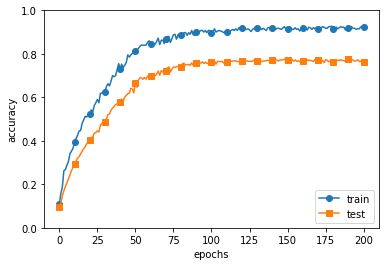


##### 가중치 감소를 적용하여 오버피팅이 어느정도 억제됨
> 하지만 훈련데이터에 대한 정확도 역시 함께 감소되었음

## 6.4.3 드롭아웃

##### 신경망이 더 복잡해지는 경우 가중치 감소만으로는 오버피팅 문제를 해결할 수 없음
> further한 기법으로 드롭아웃이 존재함 
##### 드롭아웃 : 훈련 데이터에 대해서만 데이터 흐름에 있어 은닉층의 뉴런을 임의로 삭제하여 신호를 전달하지 못하도록 하는 방법
> 시험 데이터에 대해서는 적용하지 않고 훈련 때 삭제하지 않은 비율을 곱해서 출력해줌 

##### http://chainer.org/ 에서 더 자세한 드롭아웃 구현 확인 가능


```python
#드롭아웃 구현
class Dropout:
    def __init__(self, dropout_ratio=0.5): #드롭아웃 비율을 0.5로 지정
        self.dropout_ratio = dropout_ratio 
        self.mask = None
        
    def forward(self, x, train_flg=True): #순전파 계산 #중요한 부분
        if train_flg:
            self.mask = np.random.rand(*x.shape) > self.dropout_ratio #무작위 삭제 비율 > 드롭아웃 비율
            # x와 형상이 같은 배열 생성
            return x * self.mask
        else:
            return x * (1.0 - self.dropout_ratio) #드롭아웃하지 않은 비율
        
    def backward(self, dout): #역전파(미분값) 계산
        #ReLU함수와 비슷한 매커니즘 (True일 때만 통과)
        return dout * self.mask
```

##### 역전파에서는 순전파에서 통과된 뉴런만 신호를 받을 수 있도록 지정
> ReLU 함수의 성질과 동일 


```python
# MNIST 데이터를 이용한 구현
# trainer 클래스를 구현 > 네트워크 학습을 대신해줌
# 7층의 네트워크 계층, 앞 실험과 같은 조건
import numpy as np
import matplotlib.pyplot as plt 
from dataset.mnist import load_mnist
from common.multi_layer_net_extend import MultiLayerNetExtend
from common.trainer import Trainer

(x_train, t_train), (x_test, t_test) = load_mnist(normalize = True)

#오버피팅 재현을 위해 학습 데이터 줄임
x_train = x_train[:300]
t_train = t_train[:300]

#드롭아웃 사용 유무와 비율 설정 ==============
use_dropout = True #사용하지 않을 때는 False
dropout_ratio = 0.2
#=============================================

network = MultiLayerNetExtend(input_size = 784, hidden_size_list = [100, 100, 100, 100, 100, 100],
                             output_size =10, use_dropout = use_dropout, dropout_ration = dropout_ratio)

trainer = Trainer(network, x_train, t_train, x_test, t_test, 
                 epochs = 301, mini_batch_size = 100, 
                 optimizer = 'sgd', optimizer_param = {'lr' : 0.01}, verbose = False)
trainer.train()

#그래프 그리기 ===================
markers = {'train': 'o', 'test': 's'}
x = np.arange(len(train_acc_list))
plt.plot(x, train_acc_list, marker = 'o', label = 'train', markevery = 10)
plt.plot(x, test_acc_list, marker = 's', label = 'test', markevery = 10)
plt.xlabel("epochs")
plt.ylabel("accuracy")
plt.ylim(0, 1.0)
plt.legend(loc = 'lower right')
plt.show()
```

##### 가중치 감소와 마찬가지로 오버피팅을 억제하며 훈련데이터의 정확도가 낮아지는 결과

* 앙상블 학습: 개별적으로 학습시킨 여러 모델의 출력을 평균 내어 추론하는 방식 
    > 드롭아웃과 매우 비슷한 매커니즘 1) 무작위 삭제 == 매번 다른 모델을 학습시킴 2) 삭제 비율을 곱해줌 == 평균 작업

##### 드롭아웃은 앙상블 학습을 하나의 네트워크로 나타낸 것이라고 생각할 수 있음

# 6.5 적절한 하이퍼파라미터 값 찾기

##### 하이퍼파라미터 : 인간이 직접 설정해줘야 하는 매개변수
> 각 층의 뉴런 수, 배치 크기, 학습률, 가중치 감소 등 

## 6.5.1 검증 데이터

##### 학습에 사용되는 데이터셋은 대게 오버피팅과 범용성능을 테스트하기 위해 시험데이터와 훈련데이터를 나눠서 세팅함 
##### 하이퍼파라미터의 성능을 평가하기 위해서는 검증 데이터 (validation data)를 따로 할당해 줘야 함
> 자체적으로 지정해두지 않은 경우도 있음 (훈련데이터의 일부를 직접 할당해야 함)


```python
# coding: utf-8
import numpy as np


def smooth_curve(x):
    """손실 함수의 그래프를 매끄럽게 하기 위해 사용
    
    참고：http://glowingpython.blogspot.jp/2012/02/convolution-with-numpy.html
    """
    window_len = 11
    s = np.r_[x[window_len-1:0:-1], x, x[-1:-window_len:-1]]
    w = np.kaiser(window_len, 2)
    y = np.convolve(w/w.sum(), s, mode='valid')
    return y[5:len(y)-5]


def shuffle_dataset(x, t):
    """데이터셋을 뒤섞는다.
    Parameters
    ----------
    x : 훈련 데이터
    t : 정답 레이블
    
    Returns
    -------
    x, t : 뒤섞은 훈련 데이터와 정답 레이블
    """
    permutation = np.random.permutation(x.shape[0])
    x = x[permutation,:] if x.ndim == 2 else x[permutation,:,:,:]
    t = t[permutation]

    return x, t

def conv_output_size(input_size, filter_size, stride=1, pad=0):
    return (input_size + 2*pad - filter_size) / stride + 1


def im2col(input_data, filter_h, filter_w, stride=1, pad=0):
    """다수의 이미지를 입력받아 2차원 배열로 변환한다(평탄화).
    
    Parameters
    ----------
    input_data : 4차원 배열 형태의 입력 데이터(이미지 수, 채널 수, 높이, 너비)
    filter_h : 필터의 높이
    filter_w : 필터의 너비
    stride : 스트라이드
    pad : 패딩
    
    Returns
    -------
    col : 2차원 배열
    """
    N, C, H, W = input_data.shape
    out_h = (H + 2*pad - filter_h)//stride + 1
    out_w = (W + 2*pad - filter_w)//stride + 1

    img = np.pad(input_data, [(0,0), (0,0), (pad, pad), (pad, pad)], 'constant')
    col = np.zeros((N, C, filter_h, filter_w, out_h, out_w))

    for y in range(filter_h):
        y_max = y + stride*out_h
        for x in range(filter_w):
            x_max = x + stride*out_w
            col[:, :, y, x, :, :] = img[:, :, y:y_max:stride, x:x_max:stride]

    col = col.transpose(0, 4, 5, 1, 2, 3).reshape(N*out_h*out_w, -1)
    return col


def col2im(col, input_shape, filter_h, filter_w, stride=1, pad=0):
    """(im2col과 반대) 2차원 배열을 입력받아 다수의 이미지 묶음으로 변환한다.
    
    Parameters
    ----------
    col : 2차원 배열(입력 데이터)
    input_shape : 원래 이미지 데이터의 형상（예：(10, 1, 28, 28)）
    filter_h : 필터의 높이
    filter_w : 필터의 너비
    stride : 스트라이드
    pad : 패딩
    
    Returns
    -------
    img : 변환된 이미지들
    """
    N, C, H, W = input_shape
    out_h = (H + 2*pad - filter_h)//stride + 1
    out_w = (W + 2*pad - filter_w)//stride + 1
    col = col.reshape(N, out_h, out_w, C, filter_h, filter_w).transpose(0, 3, 4, 5, 1, 2)

    img = np.zeros((N, C, H + 2*pad + stride - 1, W + 2*pad + stride - 1))
    for y in range(filter_h):
        y_max = y + stride*out_h
        for x in range(filter_w):
            x_max = x + stride*out_w
            img[:, :, y:y_max:stride, x:x_max:stride] += col[:, :, y, x, :, :]

    return img[:, :, pad:H + pad, pad:W + pad]
```


```python
(x_train, t_train), (x_test, t_test) = load_mnist()

#훈련데이터 뒤섞음 
x_train, t_train = shuffle_dataset(x_train, t_train) #데이터셋 안 치우침 문제 해결

#20%를 검증 데이터로 분할
validation_rate = 0.20
validation_num = int(x_train.shape[0] * validation_rate)

#검증 데이터셋 획득!
x_val = x_train[:validation_num]
t_val = t_train[:validation_num]
x_train = x_train[validation_num:]
t_train = t_train[validation_num:]
```

## 6.5.2 하이퍼파라미터 최적화

##### 최적값이 존재하는 범위를 조금씩 좁혀가는 방법 선택
> 1) 대략적인 범위 설정 2) 샘플링 3) 정확도 평가 4) 작업 반복, 값 획득
##### 신경망 학습에는 그리드 서치보다 샘플링이 더 적합함 
* '대략적인 범위'는 로그 스케일로 지정 (10의 거듭제곱 꼴)
* 시간이 오래걸리는 학습 단계이므로 최대한 거를 데이터는 걸러서 에폭의 크기를 작게 만드는 것이 중요함 

##### 위의 최적화 방법은 실용적이지만 과학적인 방법은 아님
> 베이즈 최적화로 과학적 접근 가능 Practical Bayesian Optimization of Machine Learning Algorithms 참고

## 6.5.3 하이퍼 파라미터 최적화 구현하기 


```python
# coding: utf-8
import sys, os
sys.path.append(os.pardir)  # 부모 디렉터리의 파일을 가져올 수 있도록 설정
import numpy as np
import matplotlib.pyplot as plt
from dataset.mnist import load_mnist
from common.multi_layer_net import MultiLayerNet
from common.util import shuffle_dataset
from common.trainer import Trainer

(x_train, t_train), (x_test, t_test) = load_mnist(normalize=True)

# 결과를 빠르게 얻기 위해 훈련 데이터를 줄임
x_train = x_train[:500]
t_train = t_train[:500]

# 20%를 검증 데이터로 분할
validation_rate = 0.20
validation_num = int(x_train.shape[0] * validation_rate)
x_train, t_train = shuffle_dataset(x_train, t_train)
x_val = x_train[:validation_num]
t_val = t_train[:validation_num]
x_train = x_train[validation_num:]
t_train = t_train[validation_num:]


def __train(lr, weight_decay, epocs=50):
    network = MultiLayerNet(input_size=784, hidden_size_list=[100, 100, 100, 100, 100, 100],
                            output_size=10, weight_decay_lambda=weight_decay)
    trainer = Trainer(network, x_train, t_train, x_val, t_val,
                      epochs=epocs, mini_batch_size=100,
                      optimizer='sgd', optimizer_param={'lr': lr}, verbose=False)
    trainer.train()

    return trainer.test_acc_list, trainer.train_acc_list


# 하이퍼파라미터 무작위 탐색======================================
optimization_trial = 100
results_val = {}
results_train = {}
for _ in range(optimization_trial):
    # 탐색한 하이퍼파라미터의 범위 지정===============
    weight_decay = 10 ** np.random.uniform(-8, -4) #가중치감소 범위지정
    lr = 10 ** np.random.uniform(-6, -2) #학습률 범위지정
    # ================================================

    val_acc_list, train_acc_list = __train(lr, weight_decay)
    print("val acc:" + str(val_acc_list[-1]) + " | lr:" + str(lr) + ", weight decay:" + str(weight_decay))
    key = "lr:" + str(lr) + ", weight decay:" + str(weight_decay)
    results_val[key] = val_acc_list
    results_train[key] = train_acc_list

# 그래프 그리기========================================================
print("=========== Hyper-Parameter Optimization Result ===========")
graph_draw_num = 20
col_num = 5
row_num = int(np.ceil(graph_draw_num / col_num))
i = 0

for key, val_acc_list in sorted(results_val.items(), key=lambda x:x[1][-1], reverse=True):
    print("Best-" + str(i+1) + "(val acc:" + str(val_acc_list[-1]) + ") | " + key)

    plt.subplot(row_num, col_num, i+1)
    plt.title("Best-" + str(i+1))
    plt.ylim(0.0, 1.0)
    if i % 5: plt.yticks([])
    plt.xticks([])
    x = np.arange(len(val_acc_list))
    plt.plot(x, val_acc_list)
    plt.plot(x, results_train[key], "--")
    i += 1

    if i >= graph_draw_num:
        break

plt.show()
```

    val acc:0.15 | lr:0.00020111897878846382, weight decay:1.7854987662642827e-07
    val acc:0.1 | lr:3.36932707619353e-06, weight decay:5.587424746878224e-08
    val acc:0.08 | lr:2.520588655432809e-05, weight decay:1.2351660127206497e-06
    val acc:0.08 | lr:1.0479789708626303e-06, weight decay:2.5974490403553887e-06
    val acc:0.37 | lr:0.0020517491093712567, weight decay:1.0169603913704784e-08
    val acc:0.11 | lr:3.387232274699382e-05, weight decay:5.671366412379734e-08
    val acc:0.74 | lr:0.008724030466681784, weight decay:1.5078870857267641e-05
    val acc:0.12 | lr:9.694227623956888e-06, weight decay:6.224572407131824e-05
    val acc:0.09 | lr:1.1063353780056697e-06, weight decay:1.4233079261793112e-07
    val acc:0.1 | lr:1.064769729358396e-05, weight decay:9.939451649176871e-08
    val acc:0.09 | lr:1.4509198635383877e-05, weight decay:1.3838721034268565e-08
    val acc:0.11 | lr:4.187423805073582e-05, weight decay:9.045858173643558e-07
    val acc:0.23 | lr:0.0014975794715547702, weight decay:2.7862181668155984e-05
    val acc:0.09 | lr:3.778498156158627e-06, weight decay:1.4238545410035162e-06
    val acc:0.69 | lr:0.006451667499772066, weight decay:2.4681505683953313e-08
    val acc:0.79 | lr:0.006297192395576325, weight decay:1.237571643616462e-05
    val acc:0.22 | lr:0.0019047615385369026, weight decay:1.5089152669401846e-08
    val acc:0.18 | lr:0.0005504908920710357, weight decay:3.1192967426758056e-05
    val acc:0.12 | lr:0.0007975483683210727, weight decay:1.9720001380843417e-07
    val acc:0.74 | lr:0.008241377071922055, weight decay:1.2502583588230306e-06
    val acc:0.78 | lr:0.008768558471390388, weight decay:3.932210876535383e-07
    val acc:0.08 | lr:1.108554040997501e-06, weight decay:5.182529973137132e-05
    val acc:0.19 | lr:0.0005234338818827654, weight decay:2.8152437024780385e-07
    val acc:0.12 | lr:2.981213571597753e-06, weight decay:1.0748553266647753e-05
    val acc:0.12 | lr:7.489806164164357e-05, weight decay:7.511222423518582e-07
    val acc:0.5 | lr:0.0033534541831026317, weight decay:4.949353507683785e-08
    val acc:0.14 | lr:1.8160166980843662e-06, weight decay:1.2857630346077083e-08
    val acc:0.11 | lr:8.414346643561604e-06, weight decay:2.202001228680661e-05
    val acc:0.48 | lr:0.004329758039068234, weight decay:1.4832521520397212e-05
    val acc:0.06 | lr:1.126060865260475e-05, weight decay:1.0463265701392814e-08
    val acc:0.08 | lr:2.4376816895925948e-06, weight decay:2.7870826528204883e-06
    val acc:0.16 | lr:2.000992912440774e-06, weight decay:9.665438198733706e-06
    val acc:0.11 | lr:7.5242065998673836e-06, weight decay:9.31211628562977e-05
    val acc:0.07 | lr:9.728767451254378e-05, weight decay:1.0960411883276723e-07
    val acc:0.12 | lr:2.0419966708219867e-06, weight decay:4.949479473079788e-06
    val acc:0.11 | lr:2.6094933305304742e-05, weight decay:7.260367250511588e-08
    val acc:0.1 | lr:0.0002191314296438221, weight decay:2.67992269819408e-08
    val acc:0.19 | lr:0.001524130257655174, weight decay:7.055523922890978e-06
    val acc:0.11 | lr:5.319659989145501e-05, weight decay:2.622491624081564e-06
    val acc:0.07 | lr:5.024927958785811e-06, weight decay:1.741202587837679e-08
    val acc:0.13 | lr:0.0011538071179862937, weight decay:9.91323605855268e-06
    val acc:0.13 | lr:0.00038967072669658014, weight decay:5.094561408283463e-05
    val acc:0.14 | lr:1.5869464823266235e-05, weight decay:6.105667672456781e-06
    val acc:0.1 | lr:0.00029593873342146347, weight decay:3.1476093652555225e-08
    val acc:0.13 | lr:3.7412027386760054e-06, weight decay:6.505117357505842e-08
    val acc:0.07 | lr:8.385828966152221e-05, weight decay:6.11886369785938e-07
    val acc:0.44 | lr:0.003049777238482429, weight decay:1.4982027244064142e-07
    val acc:0.16 | lr:0.0003047931093883675, weight decay:1.0230894875010657e-07
    val acc:0.56 | lr:0.002431704773228599, weight decay:4.928271647308607e-08
    val acc:0.12 | lr:2.4913687574566546e-06, weight decay:3.060663679670599e-06
    val acc:0.09 | lr:0.00037519428258532984, weight decay:1.551681236498118e-08
    val acc:0.61 | lr:0.0043683738027120765, weight decay:5.229214306192141e-07
    val acc:0.11 | lr:0.0009178639579372482, weight decay:2.0332251013155896e-07
    val acc:0.07 | lr:5.6192310136721514e-05, weight decay:5.290947225370039e-07
    val acc:0.14 | lr:3.294453621058045e-05, weight decay:1.246702886836503e-07
    val acc:0.07 | lr:2.360068272631111e-06, weight decay:7.831392905575845e-05
    val acc:0.23 | lr:0.0008253713873797226, weight decay:8.816750637745682e-06
    val acc:0.16 | lr:1.5981708859284234e-05, weight decay:1.7292523135855035e-05
    val acc:0.1 | lr:2.7661000708742823e-05, weight decay:1.955928640856469e-07
    val acc:0.12 | lr:1.4535991705977916e-05, weight decay:2.5073948874008296e-08
    val acc:0.15 | lr:0.00029138642122212275, weight decay:6.399089571959152e-08
    val acc:0.43 | lr:0.0029461136317863222, weight decay:1.17692628897222e-06
    val acc:0.11 | lr:1.2220296237902365e-06, weight decay:6.220345806116155e-05
    val acc:0.11 | lr:0.00020290321701479136, weight decay:1.54205167678363e-07
    val acc:0.3 | lr:0.0015852996542337458, weight decay:9.422479329257397e-08
    val acc:0.11 | lr:1.687257521667767e-06, weight decay:8.024129147980336e-07
    val acc:0.08 | lr:4.892328979460274e-06, weight decay:2.0620838750587734e-05
    val acc:0.46 | lr:0.0030964384798571527, weight decay:1.6281044142154598e-07
    val acc:0.16 | lr:0.00019759599978049297, weight decay:8.419117710502076e-05
    val acc:0.66 | lr:0.006405008608417457, weight decay:4.945210361244859e-06
    val acc:0.12 | lr:2.1618714854842443e-06, weight decay:9.114531497023998e-08
    val acc:0.37 | lr:0.0012892212790626013, weight decay:7.723016553538395e-06
    val acc:0.48 | lr:0.0023894217003470808, weight decay:1.1084318545629277e-06
    val acc:0.09 | lr:3.018058851827815e-06, weight decay:6.416772062936186e-06
    val acc:0.47 | lr:0.0013630800513058886, weight decay:1.1306248216452942e-06
    val acc:0.45 | lr:0.0027825357672936874, weight decay:3.2168913766194552e-06
    val acc:0.22 | lr:0.0009971010745063813, weight decay:1.3836406232979492e-05
    val acc:0.13 | lr:0.0005428681376428382, weight decay:7.750056929341766e-06
    val acc:0.38 | lr:0.0019040981860196833, weight decay:2.854145610173484e-06
    val acc:0.22 | lr:0.0008406532086601091, weight decay:4.055166904976848e-08
    val acc:0.06 | lr:1.1572747519474173e-06, weight decay:3.3627882303959855e-08
    val acc:0.09 | lr:0.0005782317353256114, weight decay:6.43823507787916e-05
    val acc:0.36 | lr:0.0024741845006086387, weight decay:1.3241423957353794e-08
    val acc:0.2 | lr:0.0011686516249204484, weight decay:7.80488768204239e-06
    val acc:0.1 | lr:7.880350369319112e-05, weight decay:2.2064301150951686e-06
    val acc:0.13 | lr:7.92380168052031e-06, weight decay:2.185117063814581e-06
    val acc:0.18 | lr:0.0011346579750243575, weight decay:5.6828998971410986e-08
    val acc:0.79 | lr:0.009460481353870153, weight decay:1.6287044692146324e-05
    val acc:0.09 | lr:0.0001667318638644747, weight decay:9.654892750895393e-07
    val acc:0.1 | lr:3.483275898440662e-06, weight decay:3.5193020655389984e-07
    val acc:0.08 | lr:0.00021744863772501922, weight decay:1.9272675969911688e-07
    val acc:0.17 | lr:0.0005295851448576715, weight decay:9.33527995498807e-06
    val acc:0.11 | lr:0.000100043741256772, weight decay:2.621053282171252e-05
    val acc:0.79 | lr:0.007909468120033703, weight decay:9.498905831766218e-05
    val acc:0.12 | lr:0.00014336055205838673, weight decay:4.5977925232643725e-05
    val acc:0.09 | lr:2.164527185979651e-05, weight decay:1.0946997178028299e-07
    val acc:0.28 | lr:0.0029552063180502725, weight decay:1.620066346284006e-08
    val acc:0.12 | lr:2.2188612386184656e-06, weight decay:6.051611824022268e-08
    val acc:0.27 | lr:0.0017269810171704368, weight decay:6.469092998020777e-08
    val acc:0.09 | lr:2.384449802699306e-05, weight decay:4.58985544207003e-05
    =========== Hyper-Parameter Optimization Result ===========
    Best-1(val acc:0.79) | lr:0.006297192395576325, weight decay:1.237571643616462e-05
    Best-2(val acc:0.79) | lr:0.009460481353870153, weight decay:1.6287044692146324e-05
    Best-3(val acc:0.79) | lr:0.007909468120033703, weight decay:9.498905831766218e-05
    Best-4(val acc:0.78) | lr:0.008768558471390388, weight decay:3.932210876535383e-07
    Best-5(val acc:0.74) | lr:0.008724030466681784, weight decay:1.5078870857267641e-05
    Best-6(val acc:0.74) | lr:0.008241377071922055, weight decay:1.2502583588230306e-06
    Best-7(val acc:0.69) | lr:0.006451667499772066, weight decay:2.4681505683953313e-08
    Best-8(val acc:0.66) | lr:0.006405008608417457, weight decay:4.945210361244859e-06
    Best-9(val acc:0.61) | lr:0.0043683738027120765, weight decay:5.229214306192141e-07
    Best-10(val acc:0.56) | lr:0.002431704773228599, weight decay:4.928271647308607e-08
    Best-11(val acc:0.5) | lr:0.0033534541831026317, weight decay:4.949353507683785e-08
    Best-12(val acc:0.48) | lr:0.004329758039068234, weight decay:1.4832521520397212e-05
    Best-13(val acc:0.48) | lr:0.0023894217003470808, weight decay:1.1084318545629277e-06
    Best-14(val acc:0.47) | lr:0.0013630800513058886, weight decay:1.1306248216452942e-06
    Best-15(val acc:0.46) | lr:0.0030964384798571527, weight decay:1.6281044142154598e-07
    Best-16(val acc:0.45) | lr:0.0027825357672936874, weight decay:3.2168913766194552e-06
    Best-17(val acc:0.44) | lr:0.003049777238482429, weight decay:1.4982027244064142e-07
    Best-18(val acc:0.43) | lr:0.0029461136317863222, weight decay:1.17692628897222e-06
    Best-19(val acc:0.38) | lr:0.0019040981860196833, weight decay:2.854145610173484e-06
    Best-20(val acc:0.37) | lr:0.0020517491093712567, weight decay:1.0169603913704784e-08
    


##### Best 1~ Best 5까지의 범위를 보면 학습률은 0.001~0.1, 가중치 감소 계수는 10^-8~10^-6까지의 범위를 가짐
> 이 범위 내에서 학습을 반복하여 최적값을 찾아낼 수 있음 
